# Mục lục
  - [I. Tổng quan](#chI)
      - [1. Các khái niệm cơ bản](#chI_1)
      - [2. PySpark MLlib](#chI_2)
      - [3. Machine Learning với thư viện sklearn so với PySpark Mllib](#chI_3)
  - [II. Bài toán Hồi quy Logistic trên bank datasets](#chII)
      - [1. Không sử dụng PySpark MLlib](#chII_1)
      - [2. Sử dụng PySpark MLlib](#chII_2)

# I. Tổng quan
  Apache Spark đi kèm với một thư viện tên là MLlib để thực hiện các tác vụ Học máy bằng cách sử dụng Spark framework. PySpark là một API Python cho Apache Spark và ta cũng có thể sử dụng thư viện Spark ML này trong PySpark. Thư viện MLlib chứa rất nhiều thuật toán và tiện ích Học máy cung cấp cho người dùng đầy đủ công cụ để xây dựng các mô hình Học máy và có thể song song hóa quy trình này.

## 1. Các khái niệm cơ bản
  Machine Learning (Học máy) là một trong nhiều ứng dụng của Trí tuệ nhân tạo (AI) với mục đích chính là cho phép máy tính học tự động mà không cần bất kỳ sự hỗ trợ nào của con người. Với sự trợ giúp của Học máy, máy tính có thể giải quyết các công việc mà cho đến nay, chỉ do con người xử lý và thực hiện. Về cơ bản, nó là một quá trình dạy một hệ thống về cách đưa ra dự đoán chính xác khi được cung cấp dữ liệu phù hợp. Nó có khả năng học hỏi và cải thiện từ kinh nghiệm trong quá khứ mà không cần được lập trình cụ thể cho một nhiệm vụ. Học máy chủ yếu tập trung vào việc phát triển các chương trình máy tính và thuật toán đưa ra dự đoán và học hỏi từ dữ liệu được cung cấp.
  
  Dataframes: DataFrame là một API của Apache Spark. Về cơ bản, nó là một tập hợp dữ liệu phân tán, được strongly-typed collection, tức là một tập dữ liệu được tổ chức thành các cột được đặt tên. DataFrame tương đương với Table trong cơ sở dữ liệu quan hệ, ngoại trừ thực tế là nó có các tùy chọn tối ưu hóa phong phú hơn.

  Có nhiều cách để tạo DataFrames trong Apache Spark:
  
      - Tạo DataFrame bằng Spark RDD
      - Tạo DataFrame bằng cách tải trực tiếp tệp CSV
      - Chỉ định một giản đồ (schema)để tạo DataFrame

## 2. PySpark MLlib
  Spark MLlib là tên rút gọn của thư viện Spark Machine Learning. Machine Learning trong PySpark thực ra cũng tương tự với Machine Learning thông thường, nếu các bạn đã có kiến thức về Machine Learning thì sẽ thấy nó rất dễ sử dụng và có thể mở rộng với rất nhiều tiện ích mạnh mẽ. 

  Spark MLlib hoạt động trên các hệ thống phân tán. Bạn có thể sử dụng Spark Machine Learning để phân tích dữ liệu. Có nhiều kỹ thuật khác nhau mà bạn có thể sử dụng với các thuật toán Học máy như hồi quy (regression), phân loại (classification), v.v., tất cả là nhờ PySpark MLlib.

  Một số Parameters chính của PySpark MLlib được liệt kê dưới đây:

      - Ratings: Tham số này được sử dụng để tạo RDD của ratings, rows hoặc tuples.
      - Rank: Nó hiển thị số lượng features được tính toán và xếp hạng chúng.
      - Lambda: Lambda là một tham số chính quy hóa (regularization parameter).
      - Blocks : Các khối được sử dụng để song song hóa số lượng tính toán. Giá trị mặc định cho giá trị này là −1.

## 3. Machine Learning với thư viện sklearn so với PySpark Mllib

  Mình lấy ví dụ với bài toán classification sử dụng iris datasets làm ví dụ. Đây là source code của mình: [irisDataset_ML_in_PySpark.ipynb](https://colab.research.google.com/drive/1mZKexkqn-U9zCfUswEN3AMalxjlxwE6H). Với iris [datasets](https://archive.ics.uci.edu/ml/datasets/iris), ta có thể mô phỏng các bước đơn giản nhất của việc xây dựng một mô hình học máy theo cách thông thường. Các attribute của iris datasets dưới dạng số và không có giá trị NaN nên ta có thể bỏ qua giai đoạn tiền xử lý dữ liệu.

Đối với cách làm thông thường, mình sử dụng thư viện sklearn và mô hình học máy k-NN như sau:

Bước 1: Đọc và xử lý dữ liệu dưới dạng dataframe kết quả như sau:

  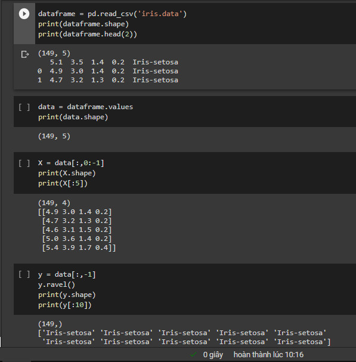

Bước 2: Split tập train/test và đưa tập train vào mô hình k-NN với k = 3:

  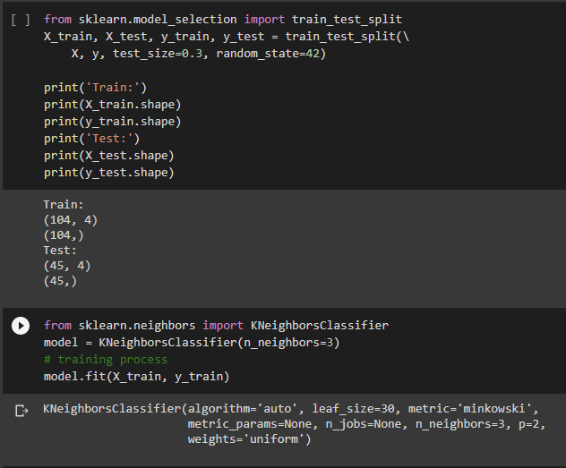
  
Bước 3: Mô hình dự đoán kết quả với tập test

  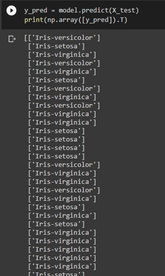
  

Đối với cách làm sử dụng Spark MLlib, ta cũng sẽ có các bước đầu tiên là đọc dữ liệu và tiền xử lý dữ liệu, kết quả dataframe của chúng ta như sau:
  
  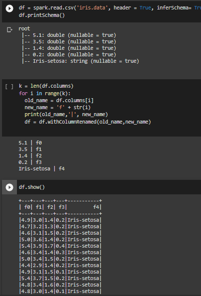

Ở bước này mình replace tên các cột trong datasets để tiện cho việc xử lý dữ liệu. Bước tiếp theo mình sẽ encoder cột label sử dụng StringIndexer, kết quả là
  
   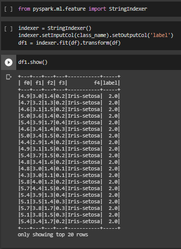

Sau khi đã encoder cột label, mình tiến hành features data sử dụng VectorAssembler như sau:

  

Bước cuối cùng là split data sử dụng randomSplit, training data sử dụng LogisticRegression từ pyspark.ml.classification và evaluation mô hình dựa trên MulticlassClassificationEvaluator:

  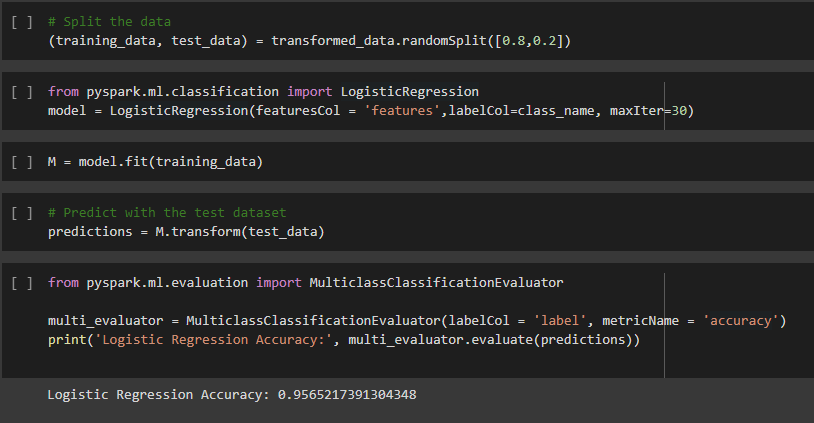

Mình lấy ví dụ đơn giản trên để minh họa cho cách xây dựng một mô hình học máy sử dụng thư viện sklearn so với MLlib trên PySpark. Trên thực tế quá trình xây dựng một mô hình học máy phức tạp hơn vậy nhiều. Bạn đọc có thể đọc cuốn [machinelearning cơ bản](https://github.com/smoothkt4951/ebookMLCB) của Vũ Hữu Tiệp để có cái nhìn chi tiết hơn về Machine Learning.

# II. Bài toán Hồi quy Logistic trên bank datasets

Để hiểu hơn về cách triển khai các mô hình Machine Learning, mình sử dụng bài toán Hồi quy Logistic với tập dữ liệu [bank-datasets](https://archive.ics.uci.edu/ml/datasets/Bank+Marketing) để xây dựng một mô hình học máy dự đoán xem liệu khách hàng của họ có khả năng ký gửi một khoản tiền vào ngân hàng trong một khoảng thời gian định kỳ hay không (Yes/No). Source code: [bank_dataset.ipynb](https://colab.research.google.com/drive/1llG_cU6rhy6f1Ly15V--qy4ZNftFJZHV#scrollTo=PAkzEOOFSmaH)

## 1. Không sử dụng PySpark MLlib

Trong phần này, mình sẽ không sử dụng PySpark MLlib mà sẽ xây dựng một mô hình học máy để giải quyết bài toán Hồi quy Logistic này bằng thư viện sklearn.

Bước đầu tiên  mình sẽ đọc dataframe từ file sau đó rename lại tên cột thành f1, f2, ..f16 cho tiện xử lý dữ liệu. Kết quả là :

  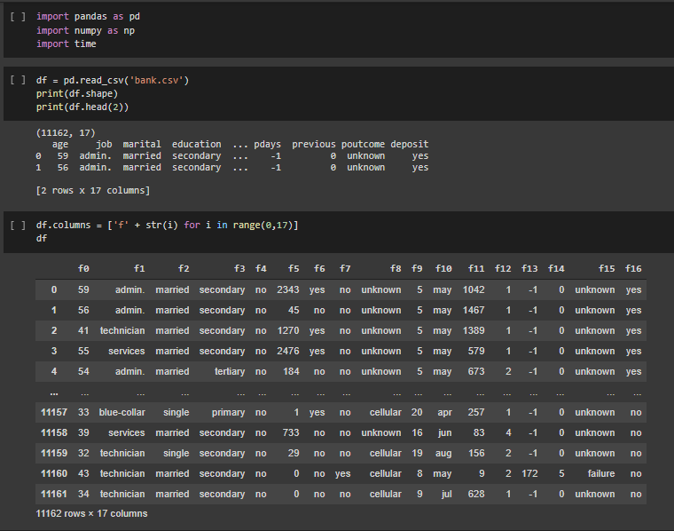

Sau đó mình tiến hành encoder các giá trị trong dataframe và concatenate các cột attribute lại thành một np.array X, khi đó y sẽ là label của bài toán này ( tức cột f16-deposite)

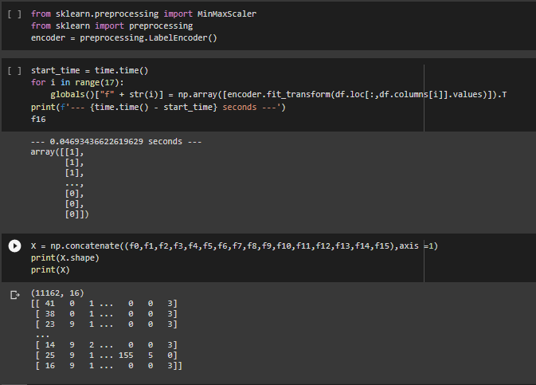

Sau khi đã split data, mình sử dụng mô hình LogisticRegression của sklearn để học train data và dự đoán dựa trên test data và cuối cùng là evaluation mô hình này.

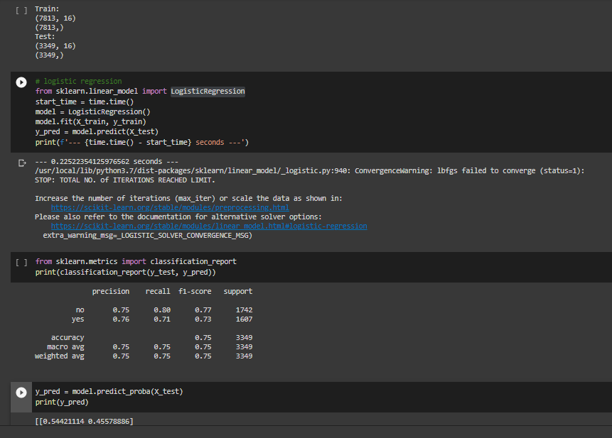

## 2. Sử dụng PySpark MLlib

<b>Bước 1: Loading Data and Data Exploration</b>

Như đã đề cập ở trên, ta sẽ sử dụng DataFrame được tạo trực tiếp từ tệp CSV. 

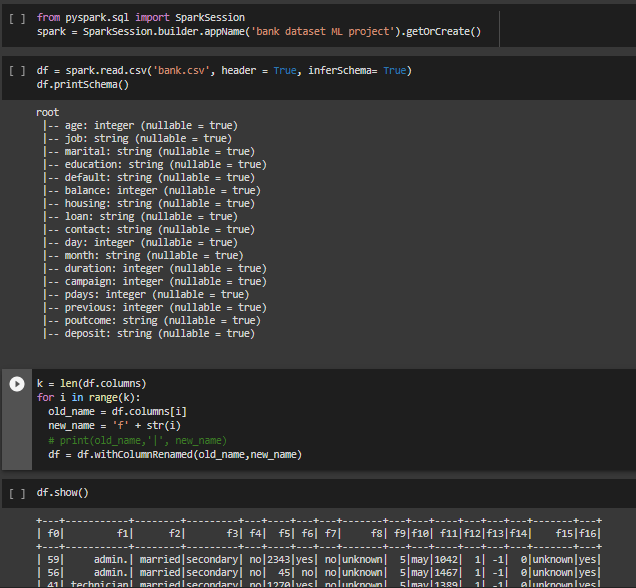

Bạn có thể chọn số hàng bạn muốn xem trong khi hiển thị dữ liệu của DataFrame bằng cách truyền parameters vào hàm show(). Ngoài ra, để kiểm tra kiểu dữ liệu của mọi cột trong DataFrame và để in lược đồ của DataFrame ở định dạng cây, bạn có thể sử dụng lệnh df.printSchema() như mình làm hoặc df.cache()

<b>Bước 2: Performing Descriptive Analysis</b>

Đây là bước hiện thực hóa việc phân tích các mô tả Dataframe, nhớm câu lệnh ở bước này như sau:

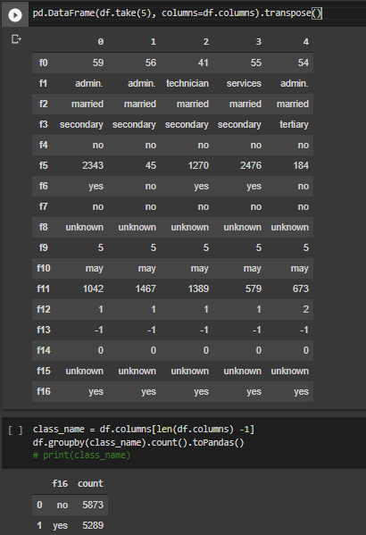

<b>Bước 3: Preparing Data</b>

Đây là bước encoder data để chuẩn bị cho việc features data bằng VectorAssembler. Tuy nhiên trước khi sử dụng StringIndexer, ta cần xác định trong Dataframe đâu là các cột cần StringIndexer. Mình sẽ thực hiệc việc xác định này bằng cách phân loại các cột trong Dataframe thành hai kiểu int và kiểu string, sau đó chỉ StringIndexer các cột có kiểu dữ liệu string như sau:

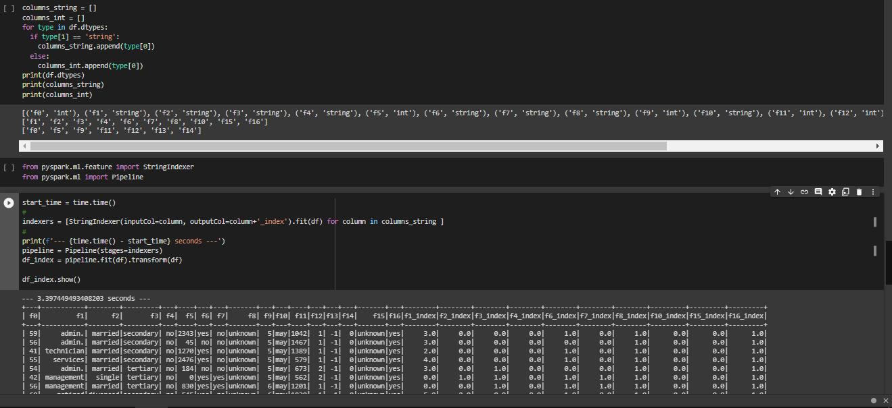

Ở bước này mình có sử dụng Pipeline của PySpark để song song hóa bước encoder. Cụ thể thay vì phải lần lượt encoder từng cột của Dataframe thì với PySpark, ta có thể đồng thời encoder tất cả các cột của Dataframe. 

<b>Bước 4: Features Data</b>

Sau khi đã StringIndex dữu liệu trong Dataframe, ta sẽ tiến hành features data bằng VectorAssembler như sau:

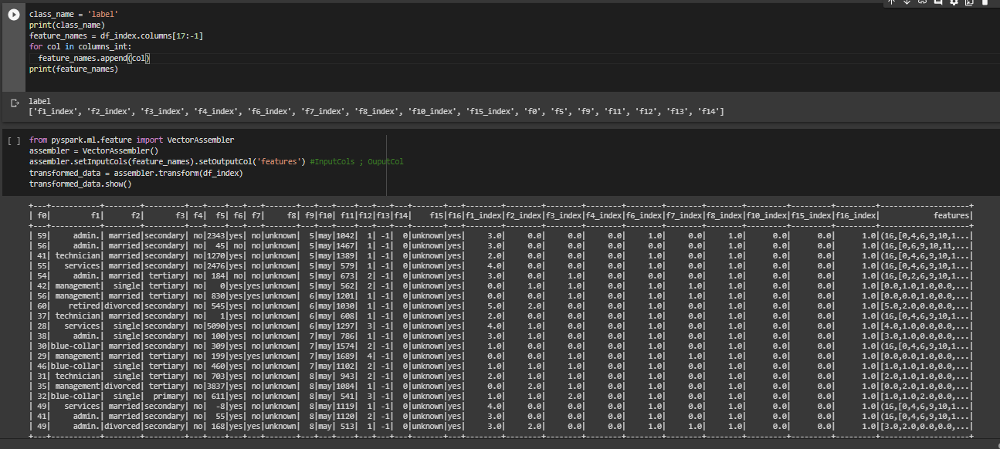

<b>Bước 5: Training Model and Evaluation</b>

Sau khi đã có vector fetures, ta đến bước split data bằng randomSplit và sử dụng  LogisticRegression của pyspark.ml.classification để làm mô hình học máy. Sau đó khi đã xây dựng xong mô hình học máy, mình sẽ đánh giá mô hình này bằng MulticlassClassificationEvaluator của pyspark.ml.evaluation như sau:

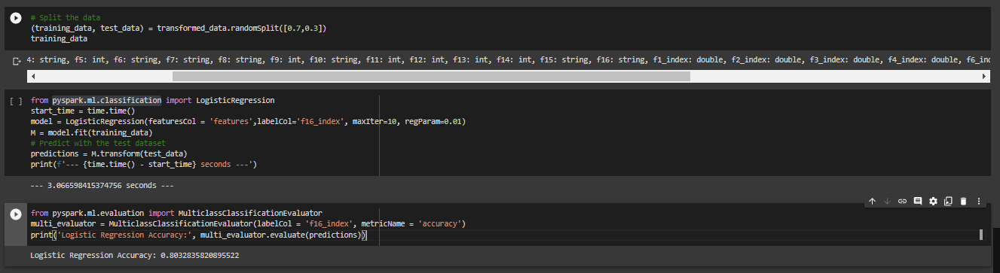

Trên đây là các bước xây dựng một mô hình học máy đơn giản để giải quyết bài toán Hồi quy Logistics sử dụng thư viện sklearn và song song hóa trên môi trường PySpark. Trên thực tế việc xây dựng một mô hình học máy sẽ phức tạp và đòi hỏi nhiều công đoạn hơn, còn đối với nội dung trong bài viết mình chỉ trình bày các bước cơ bản nhất trong quá trình xây dựng một mô hình học máy để các bạn mới tiếp cận có một cái nhìn đơn giản nhất có thể về Machine Learning nói chung và Machine Learning trong môi trường PySpark nói riêng.

## Tham khảo
1. [online] Available at: https://intellipaat.com/blog/tutorial/spark-tutorial/machine-learning-with-pyspark-tutorial/#_what_is_machine  [Accessed 30 April 2021]
2. [online] Available at: https://towardsdatascience.com/machine-learning-with-pyspark-and-mllib-solving-a-binary-classification-problem-96396065d2aa [Accessed 30 April 2021]
3. [online] Available at: https://spark.apache.org/docs/0.9.0/mllib-guide.html [Accessed 1 May 2021]
4. [online] Available at: https://spark.apache.org/docs/latest/ml-pipeline.html [Accessed 1 May 2021]
