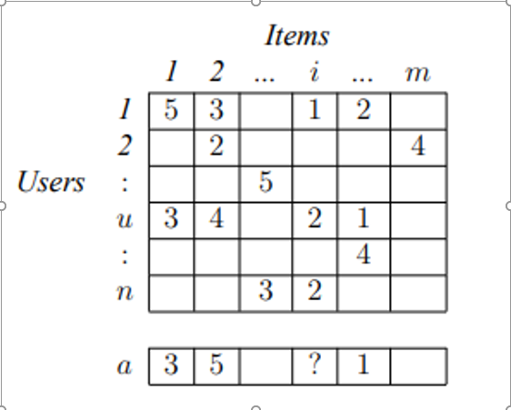
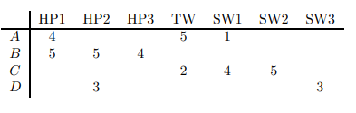
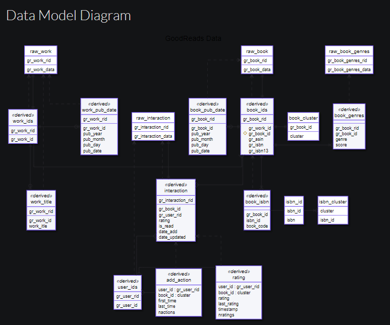

# Mục lục
  - [I. Tổng quan về Recommendation Systems](#chI)
      - [1. Mục tiêu và mô hình hóa](#chI_1)
      - [2. Cấu trúc chung của Recommendation Systems](#chI_2)
      - [3. Utility Matrix và cách áp dụng](#chI_3)
           - [3.1 Định nghĩa Utility Matrix](#chI_3_1)
           - [3.2 Áp dụng Utility Matrix trong Hệ thống khuyến nghị](#chI_3_2)
      - [4. Ứng dụng của Recommendation Systems](#chI_4)
 
  - [II. Hệ thống khuyến nghị sách](#chII)
      - [1. Datasets](#chII_1)
      - [2. Giải thuật và mô hình giải quyết bài toán](#chII_2)
           - [2.1 Phương pháp Collaborative Filtering](#chII_2_1)
                - [2.1.1 Measuring Similarity](#chII_2_1_1)
                - [2.1.2 Tính hai mặt của Similarity](#chII_2_1_2)
                - [2.1.3 Clustering Users and Items](#chII_2_1_3)
           - [2.2 Neighborhood-Based Collaborative Filtering](#chII_2_2)
                - [2.2.1 User-user Collaborative Filtering](#chII_2_2_1)
                     - [2.2.1.1 Similarity functions](#chII_2_2_1_1)
                     - [2.2.2.2 Rating prediction](#chII_2_2_2_2)
                - [2.2.2. Item-item Collaborative Filtering](#chII_2_2_2)
           - [2.3 Alternating Least Square trong Recommendation Systems](#chII_2_3)
                - [2.3.1 Alternating Least Square (ALS)](#chII_2_3_1)
                - [2.3.2 Matrix Factorization: Mục tiêu và thuật toán ALS trên Single Machine](#chII_2_3_2)
                - [2.3.3 PySpark Collaborative Filtering với thuật toán ALS](#chII_2_3_3)

# Rcommendation Systems

   Hiện nay có rất nhiều các ứng dụng liên quan đến việc dự đoán phản ứng của người dùng đối. Có thể coi một ứng dụng như vậy được là hệ thống khuyến nghị và có hai ví dụ điển hình về hệ thống khuyến nghị là: 
1. Cung cấp các bản tin cho độc giả cho các bài báo trực tuyến dựa trên dự đoán về sở thích của độc giả. 
2. Cung cấp cho khách hàng của một nhà bán lẻ trực tuyến về việc đề xuất những gì họ có thể muốn mua dựa trên lịch sử mua hàng và lịch sử tìm kiếm sản phẩm trong quá khứ của họ. 

  Hệ thống khuyến nghị sử dụng một số công nghệ khác nhau. Chúng ta có thể phân loại các hệ thống này thành hai nhóm lớnnhư sau:
 • Content-based system: Hệ thống dựa trên nội dung kiểm tra các thuộc tính của các items được đề xuất. Ví dụ: nếu người dùng Netflix đã xem nhiều phim cao bồi, thì hệ thống sẽ đề xuất một bộ phim được phân loại trong cơ sở dữ liệu là có thể loại “cowboy”.
 • Collaborative filtering systems: Hệ thống lọc cộng tác đề xuất các itesm dựa trên các biện pháp tương tự giữa users so với items. Các items được đề xuất cho users là những items được những users tương tự ưa thích. 

# I. Tổng quan về Recommendation Systems

## 1. Mục tiêu và mô hình hóa

  Mục tiêu của Hệ thống khuyến nghị (Recommender Systems) là một hệ thống tạo ra các đề xuất có ý nghĩa cho tập hợp người dùng về các mặt hàng hoặc sản phẩm mà họ có thể quan tâm. Đề xuất về sách trên Amazon hoặc phim trên Netflix là những ví dụ thực tế về mục đích hoạt động của Recommender Systems. Việc thiết kế các công cụ khuyến nghị như vậy phụ thuộc vào tên miền (domain) và các đặc điểm cụ thể của dữ liệu có sẵn. Ví dụ như những người xem phim trên Netflix thường sẽ được đánh giá phi trên thang điểm từ 1 (không thích) đến 5 (thích). Nguồn dữ liệu như vậy ghi lại chất lượng của các tương tác giữa người dùng và các mục. Ngoài ra, hệ thống có thể có quyền truy cập vào các thuộc tính trong hồ sơ của người dùng và thông tin của các mặt hàng, chẳng hạn như nhân khẩu học và mô tả sản phẩm tương ứng. 

  Các hệ thống đề xuất khác nhau ở cách chúng phân tích các nguồn dữ liệu này để phát triển các khái niệm về mối quan hệ giữa người dùng và các mục có thể được sử dụng để xác định các cặp đối sánh tốt. Hệ thống Collaborative (lọc cộng tác) chỉ phân tích các tương tác dựa trên các bản ghi lịch sử, trong khi hệ thống Content-based Filtering (lọc dựa trên nội dung) dựa trên các thuộc tính hồ sơ. Ngoài ra còn có kỹ thuật Hybrid với mục tiêu kết hợp cả hai hệ thống trên. Kiến trúc của các hệ thống khuyến nghị và đánh giá của chúng về các vấn đề trong thế giới thực là một lĩnh vực nghiên cứu tích cực.
  
  Nhận các khuyến nghị từ các nguồn đáng tin cậy là một thành phần quan trọng trong quá trình ra quyết định tự nhiên của con người. Với xu hướng tiêu dùng đang phát triển được thúc đẩy bởi sự xuất hiện của web, người mua đang có nhiều lựa chọn ngày càng tăng trong khi người bán đang phải đối mặt với thách thức cá nhân hóa các nỗ lực quảng cáo của họ. Song song đó, việc các doanh nghiệp thu một khối lượng lớn dữ liệu giao dịch cho phép phân tích sâu hơn về cách cơ sở khách hàng tương tác với không gian cung cấp sản phẩm. Hệ thống đề xuất đã phát triển để đáp ứng nhu cầu kép tự nhiên của người mua và người bán bằng cách tự động hóa tạo ra các khuyến nghị dựa trên phân tích dữ liệu.
  
  
  Cách làm truyền thống của phương pháp này là dự đoán dựa trên nội dung được áp dụng để chuyển đổi ma trận xếp hạng người dùng cơ bản thành một ma trận xếp hạng đầy đủ hơn. Sau đó, phương pháp CF được sử dụng để đưa ra các đề xuất. Trong đó họ sử dụng mô hình phân loại Naïve Bayes, được train dựa trên các tài liệu mô tả các hạng mục được xếp hạng của từng người dùng và thay thế các hạng mục chưa được xếp hạng bằng các dự đoán từ mô hình phân loại này. Họ sử dụng ma trận xếp hạng giả kết quả (pseudo ratings matrix) để tìm những người hàng xóm tương tự như người dùng đang hoạt động và đưa ra dự đoán bằng cách sử dụng “tương quan Pearson” (Pearson correlation) có trọng số thích hợp để giải thích sự trùng lặp của các mục được xếp hạng thực tế và dự đoán nội dung của người dùng đang hoạt động. 

  Có một phương pháp khác dựa trên Lọc cộng tác truyền thống, nhưng cũng duy trì cấu hình dựa trên nội dung cho mỗi người dùng. Cụ thể, các kết quả của Content-based Recommend là hồ sơ người dùng, thay vì các mục được đồng xếp hạng và được sử dụng để tìm những người dùng tương tự thì trong cách tiếp cận này, mỗi hồ sơ người dùng được biểu diễn bằng một vectơ các từ có trọng số bắt nguồn từ các ví dụ đào tạo tích cực bằng thuật toán Winnow. Các dự đoán được thực hiện bằng cách áp dụng CF trực tiếp vào ma trận hồ sơ người dùng (trái ngược với ma trận xếp hạng người dùng). Còn có một cách tiếp cận khác là sử dụng phản hồi về mức độ liên quan để đồng thời tạo ra bộ lọc cá nhân cùng với bộ lọc “chủ đề” chung. Các tài liệu ban đầu được xếp hạng theo bộ lọc chủ đề và sau đó được gửi đến bộ lọc cá nhân của người dùng. Phản hồi về mức độ liên quan của người dùng được sử dụng để sửa đổi cả bộ lọc cá nhân và bộ lọc chủ đề ban đầu. 

  Một số phương pháp kết hợp coi việc đề xuất như một nhiệm vụ phân loại và kết hợp các yếu tố hợp tác trong nhiệm vụ này. Trong phương pháp này, ta có thể sử dụng Ripper, một hệ thống quy tắc, để tìm hiểu một chức năng đưa người dùng và phim và dự đoán xem phim sẽ được thích hay không thích. Họ kết hợp thông tin cộng tác và thông tin nội dung, bằng cách tạo ra các tính năng như phim hài được người dùng yêu thích và người dùng thích phim thể loại X. Ta cũng có thể kết hợp trực tiếp nội dung và dữ liệu cộng tác trong một khuôn khổ xác suất duy nhất. Cụ thể, ta có thể sử dụng aspect model của Hofmann để kết hợp dữ liệu đồng xuất hiện ba chiều giữa người dùng, mục và nội dung mục. Mô hình chung của họ giả định rằng người dùng chọn các chủ đề tiềm ẩn và các tài liệu và từ nội dung của họ được tạo ra từ các chủ đề này. Cách tiếp cận này tập trung vào việc đưa ra các đề xuất cho các mặt hàng chưa được đánh giá bởi bất kỳ người dùng nào.

## 2. Cấu trúc chung của Recommendation Systems
  Cấu trúc chung nhất trong đó các hệ thống khuyến nghị được nghiên cứu được trình bày trong hình dưới đây:
  
  
  
  Sở thích của người dùng đã thu thập sẽ được biểu diễn dưới dạng ma trận gồm n người dùng và m mục, trong đó mỗi ô ru, i tương ứng với xếp hạng do người dùng u đưa ra cho mục i. Ma trận xếp hạng người dùng này thường thưa thớt, vì hầu hết người dùng không xếp hạng hầu hết các mặt hàng. Nhiệm vụ đề xuất là dự đoán xếp hạng mà người dùng sẽ đưa ra cho một mặt hàng chưa được xếp hạng trước đó. Thông thường, xếp hạng được dự đoán cho tất cả các mục chưa được người dùng quan sát và các mục được xếp hạng cao nhất được trình bày dưới dạng đề xuất. Người dùng đang được xem xét hiện tại cho các đề xuất được gọi là người dùng đang hoạt động.

Các phương pháp tiếp cận đối với Hệ thống đề xuất có thể được phân loại nhưcsau:
 • Lọc cộng tác (Collaborative Filtering- CF): Trong hệ thống CF, người dùng được đề xuất các mục dựa trên xếp hạng trước đây của tất cả người dùng chung. 
• Đề xuất dựa trên nội dung (Content-based recommending ): Các cách tiếp cận này đề xuất các mặt hàng có nội dung tương tự với các mặt hàng mà người dùng đã thích trong quá khứ hoặc phù hợp với thuộc tính của người dùng
• Phương pháp kết hợp (Hybrid approaches): Các phương pháp này kết hợp cả Collaborative Filtering và Content-based recommending.

## 3. Utility Matrix và cách áp dụng

### 3.1 Định nghĩa Utility Matrix

  Trong một ứng dụng của hệ thống khuyến nghị có hai lớp thực thể thường được gọi là users và items. Users có các tùy chọn cho các items nhất định và các tùy chọn này phải được đưa ra khỏi dữ liệu. Bản thân dữ liệu được biểu diễn dưới dạng Utility Matrix (ma trận tiện ích). Ma trận Utility Matrix cung cấp cho mỗi cặp item-user một giá trị đại diện cho những gì đã biết về mức độ ưa thích của người dùng đó đối với mặt hàng đó. Giá trị này đến từ một tập hợp có thứ tự, ví dụ: số nguyên 1–5 đại diện cho số sao mà người dùng đưa ra làm xếp hạng cho mặt hàng đó. Trên thực tế thông thường người ta sẽ giả định rằng ma trận là một ma trận thưa thớt, có nghĩa là hầu hết các entries  là ‘unknown’. Việc xếp hạng ‘unknown’ ngụ ý rằng không có thông tin rõ ràng về sở thích của người dùng đối với mặt hàng.
  

Mục tiêu của hệ thống khuyến nghị là dự đoán các khoảng trống trong Utility Matrix. Ví dụ minh họa cho một Utility Matrix như hình trên. Ta sẽ đặt câu hỏi người dùng A có thích SW2 hay không? Có rất ít bằng chứng từ Utility Matrix trên để có thể trả lời câu hỏi đó. Người ta có thể thiết kế hệ thống đề xuất của mình để tính đến các đặc tính của phim, chẳng hạn như nhà sản xuất, đạo diễn, các ngôi sao hoặc thậm chí là sự giống nhau về tên của họ. Nếu vậy, chúng ta có thể lưu ý sự giống nhau giữa SW1 và SW2, và sau đó kết luận rằng vì A không thích SW1 nên họ cũng không thích SW2. Ngoài ra, với nhiều dữ liệu hơn, chúng ta có thể nhận thấy rằng những người đã xếp hạng cả SW1 và SW2 có xu hướng cho họ xếp hạng tương tự nhau. Do đó ở đây ta có thể kết luận rằng A cũng sẽ hơi thích SW2 hoặc sẽ cho SW2 một rating thấp tương tự như rating SW1 của A.

Trên thực tế ta không cần thiết phải dự đoán mọi entries trống trong Utility Matrix. Thay vào đó, chỉ cần phát hiện ra một số entries trong mỗi hàng có khả năng cao. Trong hầu hết các ứng dụng, hệ thống đề xuất không cung cấp cho người dùng bảng xếp hạng của tất cả entries, mà đề xuất một ít trong số đó mà người dùng nên đánh giá cao. Thậm chí có thể không cần thiết phải tìm tất cả các entries có xếp hạng mong đợi cao nhất mà chỉ cần tìm một tập hợp con lớn các entries có xếp hạng cao nhất.

### 3.2 Áp dụng Utility Matrix trong Hệ thống khuyến nghị

Nếu không có Utility Maxtrix thì hầu như không thể giới thiệu các mặt hàng đến với người dùng. Tuy nhiên, việc thu thập dữ liệu để từ đó xây dựng Utility Maxtrix thường gặp nhiều khó khăn. Có hai cách tiếp cận chung để khai phá các giá trị mà người dùng đặt trên các mặt hàng:
 1. Yêu cầu người dùng xếp hạng các mặt hàng: Xếp hạng phim thường được lấy theo cách này và một số cửa hàng trực tuyến cố gắng lấy xếp hạng từ người mua của họ. Các trang web cung cấp nội dung chẳng hạn như một số trang tin tức hoặc YouTube cũng yêu cầu người dùng xếp hạng các mục. Cách tiếp cận này bị hạn chế về hiệu quả của nó, vì nói chung người dùng không muốn cung cấp phản hồi và thông tin từ những người làm có thể bị sai lệch bởi thực tế là nó đến từ những người sẵn sàng cung cấp xếp hạng. 
2. Đưa ra suy luận từ hành vi của người dùng:  Rõ ràng nhất, nếu người dùng mua một sản phẩm tại Amazon, xem phim trên YouTube hoặc đọc một bài báo, thì người dùng có thể được cho là “thích” mặt hàng này. Lưu ý rằng hệ thống xếp hạng loại này thực sự chỉ có một giá trị: 1 có nghĩa là người dùng thích mặt hàng đó. Thông thường, chúng tôi tìm thấy một ma trận tiện ích với loại dữ liệu này được hiển thị bằng số 0 thay vì khoảng trống mà người dùng chưa mua hoặc xem mặt hàng. Tuy nhiên, trong trường hợp này 0 không phải là đánh giá thấp hơn 1; Nó không phải là đánh giá ở tất cả. Nói một cách tổng quát hơn, người ta có thể suy ra sự quan tâm từ hành vi khác với hành vi mua hàng. Ví dụ: nếu một khách hàng của Amazon xem thông tin về một mặt hàng, chúng tôi có thể suy ra rằng họ quan tâm đến mặt hàng đó, ngay cả khi họ không mua nó.

## 4. Ứng dụng của Recommendation Systems 

Chúng ta đã đề cập đến một số ứng dụng quan trọng của hệ thống khuyến nghị, dưới đây là danh sách chúng em liệt kê một vài ứng dụng nổi bật nhất của Recommendation Systems:

•	Product Recommendations: Có thể nói việc sử dụng hệ thống khuyến nghị là cực kỳ quan trọng đối với các nhà bán lẻ trực tuyến như Tiki, Lazada hay Shopee. Những đề xuất của hệ thống này là không phải ngẫu nhiên mà dựa trên các quyết định mua hàng do khách hàng hoặc các kỹ thuật khác để quyết định đưa ra đề xuất đó.

•	Movie Recommendations: Netflix cung cấp cho khách hàng các đề xuất về phim mà họ có thể thích. Các khuyến nghị này dựa trên xếp hạng do người dùng cung cấp, giống như xếp hạng được đề xuất trong Utility Matrix. Tầm quan trọng của việc dự đoán xếp hạng chính xác là cao đến mức Netflix đã đưa ra giải thưởng trị giá một triệu đô la cho thuật toán đầu tiên có thể đánh bại hệ thống khuyến nghị của chính mình 10% . Hệ thống mà chúng em triển khai sẽ là Hệ thống khuyến nghị sách, một hệ thống có mục đích hoạt động tương tự với hệ thống khuyến nghị phim này. 

•	News Articles: Các dịch vụ tin tức đã cố gắng xác định các bài báo mà độc giả quan tâm dựa trên các bài báo mà họ đã đọc trong quá khứ. Sự giống nhau này có thể dựa trên sự tương quan về ngữ nghĩa của các từ quan trọng trong tài liệu hoặc trên các bài báo được đọc bởi những người có cùng sở thích đọc. Các nguyên tắc tương tự cũng áp dụng cho việc đề xuất các blog trong số hàng triệu blog có sẵn, video trên YouTube hoặc các trang web khác nơi nội dung được cung cấp liên tục tăng.

# II. Hệ thống khuyến nghị sách

## 1. Datasets

Đọc sách mang lại lợi ích cho các cá nhân và xã hội, tuy nhiên có rất nhiều nghiên cứu chỉ ra rằng việc đọc sách đã không còn phổ biến và số lượng người đọc sách đang giảm dần đặc biệt là ở những người trẻ tuổi. Hệ thống khuyến nghị sách có thể giúp ngăn chặn sự suy giảm đó. Nhóm chúng em sẽ trình bày quá trình xây dựng một hệ thống khuyến nghị sách với mong muốn mang lại lợi ích cho cộng đồng đọc sách và nâng cao số lượng người đọc sách. Trong hệ thống khuyến nghị sách này, chúng em sử dụng Goodreads Datasets từ UCSD Book Graph làm tập dữ liệu cho việc xây dựng hệ thống. 

Goodreads Datasets được thu thập vào cuối năm 2017 từ trang web goodreads.com, mọi người đều có thể xem nó trên web mà không cần đăng nhập. Tuy nhiên ID người dùng và ID đánh giá sẽ được ẩn danh. Sơ đồ dưới đây cung cấp một cái nhìn tổng quan nhất về Goodreads Datasets:

Goodreads Datasets có thể được chia làm ba nhóm tập dữ liệu:

•	Meta-data of the books, siêu dữ liệu về sách, khoảng 2gb và được thu thập từ khoảng 2.36 triệu cuốn sách.
•	User-book interactions, tương tác giữa người dùng với sách, khoảng 11gb và được thu thập từ hơn 229 triệu tương tác giữa người dùng với sách.
•	Users' detailed book reviews, đánh giá chi tiết về sách của người dùng. Đây là một tập dữ liệu với văn bản đánh giá đa ngôn ngữ hoàn chỉnh và không có thẻ spoiler. Tập dữ liệu này tương đối lớn, nó chứa hơn 15 triệu bài đánh giá về khoảng 2 triệu cuốn sách và 465 nghìn người dùng. 

Các tập dữ liệu này đều có các tập con nhỏ hơn phục vụ cho nhiều mục đích khác nhau và có thể được hợp nhất với nhau bằng sự tương quan với id của book/user/review. Dưới đây là thống kê cơ bản về Goodreads Datasets được cập nhật vào tháng 5/2019:

•	2.360.655 cuốn sách (1.521.962 tác phẩm, 400.390 tập sách, 829.529 tác giả)
•	876.145 người dùng; 228.648.342 lượt tương tác với sách của người dùng trên giá sách của người dùng (bao gồm 112.131.203 lượt đọc và 104.551.549 lượt xếp hạng).

##### updating...
