# Xử Lý Dữ Liệu Lớn
## Giới thiệu
  Bài viết này được tạo ra với mục đích ghi lại toàn bộ quá trình học tập, nghiên cứu về Xử Lý Dữ Liệu Lớn của mình, qua đó tổng hợp lại các kiến thức từ tổng quan đến chi tiết những gì mình học tập, nghiên cứu và thực hành được. Trong mỗi phần mình trình bày về lý thuyết sẽ có các phần code demo, phần demo sẽ được code bằng ngôn ngữ Python3, lưu file với đuôi là .ipynb. 

## Mục lục
- [A.Trình bày tổng quan về Apache Spark và Mapreduce](#chA)
  - [I. Tổng quan về Apache Spark](#I.-tong-quan-ve-apache-spark)
    - [ 1. Giới thiệu](#1.-gioi-thieu)
    - [ 2. Các thành phần của Apache Spark](#2.-cac-thanh-phan-cua-apache-spark)
    - [ 3. Những tính năng nổi bật](#3.-nhung-tinh-nang-noi-bat)
    - [ 4. Quản lý bộ nhớ của Apache Spark](#4.-quan-ly-bo-nho-cua-apache-spark)
  - [II. Tổng quan về Mapreduce](#II.-tong-quan-ve-mapreduce)
    - [ 1. Hadoop và Mapreduce](#1.-hadoop-mapreduce)
    - [ 2. Mapreduce và các thủ tục chính](#2.-mapreduce-va-cac-thu-tuc-chinh)
    - [ 3. Hàm Map và Reduce](#3.-ham-map-va-mapreduce)
    - [ 4. Nguyên tắc hoạt động ](#4.-nguyen-tac-hoat-dong)
    - [ 5. Các bước hoạt động của MapReduce](#5.-cac-buoc-hoat-dong)
    - [ 6. Luồng dữ liệu nền tảng của Mapreduce](#6.-luong-du-lieu)
    - [ 7. Ứng dụng của Mapreduce](#7.-ung-dung)
  - [III. Ví dụ minh họa](#vd)
- [B.Trình bày tổng quan về Spark Properties, Spark RDDs và Spark Dataframes](#chB)
  - [I. Spark properties](#chB_I)
    - [ 1. Tổng quan](#chB_I_1)
    - [ 2. Tải động đối với các thuộc tính của Spark](#chB_I_2)
    - [ 3. Tổng hợp và phân loại các thuộc tính trong Spark](#chB_I_3)
  - [II. Spark RDD](#chB_II)
     - [1. Tổng quan](#chB_II_1)
     - [2. Cài đặt Spark](#chB_II_2)
     - [3. Khởi tạo Spark](#chB_II_3)
     - [4. Resilient Distributed Datasets (RDDs)](#chB_II_4)
   - [III. Spark DataFrames](#chB_III)
     - [1. Tổng quan](#chB_III_1)
     - [2. Sử dụng DataFrames bổ sung cho RDD trong Spark](#chB_III_2)
     - [3. Tính năng chính của DataFrames](#chB_III_3)
     - [4. Khởi tạo DataFrames](#chB_III_4)
     - [5. Làm việc với DataFrames](#chB_III_5)
- [C.Thuật toán A_priori trên môi trường PySpark và bài toán Association Rule](#chC)
   - [I. Tổng quan](#chC_I)
   - [II. Bài toán Association Rules với cơ sở dữ liệu store_data](#chC_II)
- [D. Thuật toán Locality Sensitive Hashing trong bài toán Finding Similar Documents in Massive Data](#chD)
  - [I. Tổng quan](#chD_I)
    - [ 1. Bài toán tìm kiếm các văn bản tương tự trong tập văn bản](#chD_I_1)
    - [ 2. Jaccard Similarity](#chD_I_2)
  - [II. Phương pháp Shingling](#chD_II)
  - [III. Phương pháp Minhashing](#chD_III)
  - [IV. Phương pháp Locality Sensitive Hashing](#chD_IV)
     - [1. Phương pháp LSH trong tập tài liệu văn bản](#chD_IV_1)
     - [2. Phương pháp LSH cho Minhash Signatures](#chD_IV_2)
     - [3. Phân tích phương pháp LSH](#chD_IV_3)

- [Tham khảo](#refer)
<a name="chA"></a>
# A.Trình bày tổng quan về Apache Spark và Mapreduce
<a name="I.-tong-quan-ve-apache-spark"></a>
## I. Tổng quan về Apache Spark
<a name="1.-gioi-thieu"></a>
### 1. Giới thiệu
  Apache Spark là một open source cluster computing framework được phát triển vào năm 2009 bởi AMPLab tại đại học California. Sau này, Spark đã được truyền lại cho Apache Software Foundation vào năm 2013 và được phát triển cho đến nay.

  Apache Spark  cho phép xây dựng các predition model ( mô hình dự đoán) nhanh chóng với việc tính toán được thực hiện trên một nhóm các máy tính, nó có thể tính toán cùng lúc trên toàn bộ tập dữ liệu mà không cần phải trích xuất mẫu tính toán thử nghiệm. Tốc độ xử lý của Spark dựa trên việc tính toán được thực hiện cùng lúc trên nhiều máy khác nhau. Đồng thời việc tính toán được thực hiện ở bộ nhớ trong (in-memories) hay thực hiện hoàn toàn trên RAM.
 
 <a name="2.-cac-thanh-phan-cua-apache-spark"></a>
 ### 2. Các thành phần của Apache Spark
  Matei Zaharia là cha đẻ của Spark, ông này sử dụng Hadoop từ những ngày đầu phát triển spark. Đến năm 2009 ông viết Apache Spark để giải quyết những bài toán học máy ở đại học UC Berkely vì Hadoop MapReduce hoạt động không hiệu quả cho những bài toán này. Sau đó ông nhận ra rằng Spark không chỉ hữu ích cho học máy mà còn cho cả việc xử lý luồng dữ liệu hoàn chỉnh.
  
   
   
  Thành phần cơ bản của Spark là Spark Core: cung cấp những chức năng cơ bản nhất của Spark như lập lịch cho các tác vụ, quản lý bộ nhớ, fault recovery, tương tác với các hệ thống lưu trữ…Đặc biệt, Spark Core cung cấp API để định nghĩa RDD (Resilient Distributed DataSet) là tập hợp của các item được phân tán trên các node của cluster và có thể được xử lý song song.
  
  Spark có thể chạy trên nhiều loại Cluster Managers như Hadoop YARN, Apache Mesos hoặc trên chính cluster manager được cung cấp bởi Spark được gọi là Standalone Scheduler.
  
  Spark SQL cho phép truy vấn dữ liệu cấu trúc qua các câu lệnh SQL. Spark SQL có thể thao tác với nhiều nguồn dữ liệu như Hive tables, Parquet, và JSON.
  
  Spark Streaming cung cấp API để dễ dàng xử lý dữ liệu stream
MLlib Cung cấp rất nhiều thuật toán của học máy như: classification, regression, clustering, collaborative filtering… Còn GraphX là thư viện để xử lý đồ thị.
<a name="3.-nhung-tinh-nang-noi-bat"></a>
### 3. Những tính năng nổi bật
- “Spark as a Service”: Giao diện REST để quản lí (submit, start, stop, xem trạng thái) spark job, spark context
- Tăng tốc, giảm độ trễ thực thi job xuống mức chỉ tính bằng giây bằng cách tạo sẵn spark context cho các job dùng chung.
- Stop job đang chạy bằng cách stop spark context
- Bỏ bước upload gói jar lúc start job làm cho job được start nhanh hơn.
- Cung cấp hai cơ chế chạy job đồng bộ và bất đồng bộ
- Cho phép cache RDD theo tên , tăng tính chia sẻ và sử dụng lại RDD giữa các job
- Hỗ trợ viết spark job bằng cú pháp SQL
- Dễ dàng tích hợp với các công cụ báo cáo như: Business Intelligence, Analytics, Data Integration Tools
<a name="4.-quan-ly-bo-nho-cua-apache-spark"></a>
### 4. Quản lý bộ nhớ của Apache Spark
  Spark giải quyết các vấn đề vấn đề xung quanh định nghĩa Resilient Distributed Datasets (RDDs). RDDs hỗ trợ hai kiểu thao tác thao tác: transformations và action. Thao tác chuyển đổi(tranformation) tạo ra dataset từ dữ liệu có sẵn. Thao tác actions trả về giá trị cho chương trình điều khiển (driver program) sau khi thực hiện tính toán trên dataset.

  Spark thực hiện đưa các thao tác RDD chuyển đổi vào DAG (Directed Acyclic Graph) và bắt đầu thực hiện. Khi một action được gọi trên RDD, Spark sẽ tạo DAG và chuyển cho DAG scheduler. DAG scheduler chia các thao tác thành các nhóm (stage) khác nhau của các task. Mỗi Stage bao gồm các task dựa trên phân vùng của dữ liệu đầu vào có thể pipline với nhau và có thể thực hiện một cách độc lập trên một máy worker. DAG scheduler sắp xếp các thao tác phù hợp với quá trình thực hiện theo thời gian sao cho tối ưu nhất. Ví dụ: các thao tác map sẽ được đưa vào cùng một stage do không xảy ra shuffle dữ liệu giữa các stage. Kết quả cuối cùng của DAG scheduler là một tập các stage. Các Stages được chuyển cho Task Scheduler. Task Scheduler sẽ chạy các task thông qua cluster manager (Spark Standalone/Yarn/Mesos). Task scheduler không biết về sự phụ thuộc của các stages. Nó chỉ chịu trách nhiệm thực hiện sắp xếp các task một cách tối ưu nhất.
  
  Mỗi Worker bao gồm một hoặc nhiều Excuter. Các excuter chịu trách nhiệm thực hiện các task trên các luồng riêng biệt. Việc chia nhỏ các task giúp đem lại hiệu năng cao hơn, giảm thiểu ảnh hưởng của dữ liệu không đối xứng (kích thước các file không đồng đều).
Quá trình Spark xây dựng DAG: Có hai kiểu chuyển đổi có thể áp dụng trên các RDDs đó là chuyển đổi hẹp và chuyển đổi rộng:

– Chuyển đổi hẹp: không yêu cầu xáo trộn dữ liệu vượt qua các phân vùng (partition).Ví dụ như các thao tác map, filter,..

– Chuyển đổi rộng yêu cầu dữ liệu phải xáo trộn. Ví dụ: reduceByKey, sortByKey, groupByKey,…
  
  Spark truy cập dữ liệu được lưu trữ ở các nguồn khác nhau như: HDFS, Local Disk, RAM. Cache Manager sử dụng Block Manager để quản lý dữ liệu. Cache Manager quản lý dữ liệu nào được Cache trên RAM, thông thường là dữ liệu được sử dụng thường xuyên nhất, nó cũng có thể được xác định thủ công bằng tay sử dụng phương thức persit hoặc cache. Nếu kích thước RAM không đủ chứa dữ liệu thì dữ liệu sẽ được lưu trữ sang Tachyon và cuối cùng là lưu trữ lên đĩa. Khi dữ liệu(RDD) không được lưu trữ trên RAM, khi có nhu cầu sử dụng đến, chúng sẽ được recompute lại. Nó sử dụng một khái niệm là “storage level” để quản lý cấp độ của lưu trữ của dữ liệu.
  
<a name="II.-tong-quan-ve-mapreduce"></a>
## II. Tổng quan về Mapreduce
<a name="1.-hadoop-mapreduce"></a>
### 1. Hadoop và Mapreduce
  Hadoop là một framwork giúp lưu trữ và xử lý Big Data áp dụng MapReduce. Nói đơn giản cách khác nó sẽ giúp sắp xếp dữ liệu sao cho user có thể dễ dàng sử dụng nhất.

  MapReduce được Google tạo ra ban đầu để xử lý đống dữ liệu lớn của công ty họ. Ta còn có thể gọi phương pháp này là Phân tán dữ liệu vì nó tách hết tập hợp các dữ liệu ban đầu thành các dữ liệu nhỏ và sắp xếp lại chúng để dễ dàng tìm kiếm và truy xuất hơn, đặc biệt là việc truy xuất các dữ liệu tương đồng. Ví dụ thường thấy nhất là các đề xuất mà ta hay thấy ở Google tìm kiếm

  Như vậy mô hình lập trình Map Reduce là nền tảng ý tưởng của Hadoop. Bản thân Hadoop là một framework cho phép phát triển các ứng dụng phân tán phần cứng thông thường . Các phần cứng này thường có khả năng hỏng hóc cao. Khác với loại phần cứng chuyên dụng đắt tiền, khả năng xảy ra lỗi thấp như các supermicrocomputer chẳng hạn.

  Hadoop được viết bằng Java. Tuy nhiên, nhờ cơ chế streaming, Hadoop cho phép phát triển các ứng dụng phân tán bằng cả java lẫn một số ngôn ngữ lập trình khác như C++, Python, Pearl.
<a name="2.-mapreduce-va-cac-thu-tuc-chinh"></a>
### 2. Mapreduce và các thủ tục chính
  MapReduce là mô hình được thiết kế độc quyền bởi Google, nó có khả năng lập trình xử lý các tập dữ liệu lớn song song và phân tán thuật toán trên 1 cụm máy tính.
  
  MapReduce sẽ  bao gồm những thủ tục sau: thủ tục 1 Map() và 1 Reduce(). Thủ tục Map() bao gồm lọc (filter) và phân loại (sort) trên dữ liệu khi thủ tục khi thủ tục Reduce() thực hiện quá trình tổng hợp dữ liệu. Đây là mô hình dựa vào các khái niệm biển đối của bản đồ và reduce những chức năng lập trình theo hướng chức năng. Thư viện của thủ tục Map() và Reduce() sẽ được viết bằng nhiều loại ngôn ngữ khác nhau. Thủ tục được cài đặt miễn phí và được sử dụng phổ biến nhất là là Apache Hadoop.
<a name="3.-ham-map-va-mapreduce"></a>
### 3. Hàm Map và Reduce
  MapReduce có 2 hàm chính là Map() và Reduce(), đây là 2 hàm đã được định nghĩa bởi người dùng và nó cũng chính là 2 giai đoạn liên tiếp trong quá trình xử lý dữ liệu của MapReduce. Nhiệm vụ cụ thể của từng hàm như sau: 
  
    - Hàm Map(): Có nhiệm vụ nhận Input cho các cặp giá trị/  khóa và output chính là tập những cặp giá trị/khóa trung gian. Sau đó, chỉ cần ghi xuống đĩa cứng và tiến hành thông báo cho các hàm Reduce() để trực tiếp nhận dữ liệu. 
    
    - Hàm Reduce(): Có nhiệm vụ tiếp nhận từ khóa trung gian và những giá trị tương ứng với lượng từ khóa đó. Sau đó, tiến hành ghép chúng lại để có thể tạo thành một tập khóa khác nhau. Các cặp khóa/giá trị này thường sẽ thông qua một con trỏ vị trí để đưa vào các hàm reduce. Quá trình này sẽ giúp cho lập trình viên quản lý dễ dàng hơn một lượng danh sách cũng như  phân bổ giá trị sao cho  phù hợp nhất với bộ nhớ hệ thống. 
    
Ở giữa Map và Reduce thì còn 1 bước trung gian đó chính là Shuffle. Sau khi Map hoàn thành  xong công việc của mình thì Shuffle sẽ làm nhiệm vụ chính là thu thập cũng như tổng hợp từ khóa/giá trị trung gian đã được map sinh ra trước đó rồi chuyển qua cho Reduce tiếp tục xử lý.
<a name="4.-nguyen-tac-hoat-dong"></a>
### 4. Nguyên tắc hoạt động 
Mapreduce hoạt động dựa vào nguyên tắc chính là “Chia để trị”, như sau:
- Phân chia các dữ liệu cần xử lý thành nhiều phần nhỏ trước khi thực hiện. 
- Xử lý các vấn đề nhỏ theo phương thức song song trên các máy tính rồi phân tán hoạt động theo hướng độc lập.
Tiến hành tổng hợp những kết quả thu được để đề ra được kết quả sau cùng. 
<a name="5.-cac-buoc-hoat-dong"></a>
### 5. Các bước hoạt động của MapReduce
- Bước 1: Tiến hành chuẩn bị các dữ liệu đầu vào để cho Map() có thể xử lý.
- Bước 2: Lập trình viên thực thi các mã Map() để xử  lý. 
- Bước 3: Tiến hành trộn lẫn các dữ liệu được xuất ra bởi Map() vào trong Reduce Processor
- Bước 4: Tiến hành thực thi tiếp mã Reduce() để có thể xử lý tiếp các dữ liệu cần thiết.  
- Bước 5: Thực hiện tạo các dữ liệu xuất ra cuối cùng. 
<a name="6.-luong-du-lieu"></a>
### 6. Luồng dữ liệu nền tảng của Mapreduce
- Input Reader
- Map Function
- Partition Function
- Compare Function
- Reduce Function
- Output Writer
<a name="7.-ung-dung"></a>
### 7. Ứng dụng của Mapreduce
MapReduce được ứng dụng cho việc thống kê hàng loạt những số liệu cụ thể như sau: 
- Thực hiện thống kê cho các từ khóa được xuất hiện ở trong các tài liệu, bài viết, văn bản hoặc được cập nhật trên hệ thống fanpage, website,…
- Khi số lượng các bài viết đã được thống kê thì tài liệu sẽ có chứa các từ khóa đó. 
- Thống kê được những câu lệnh match, pattern bên trong các tài liệu đó
- Khi thống kê được số lượng các URLs có xuất hiện bên trong một webpages. 
- Thống kê được các lượt truy cập của khách hàng sao cho nó có thể tương ứng với các URLs.
- Thống kê được tất cả từ khóa có trên website, hostname,…
<a name="vd"></a>
## Ví dụ minh họa
Trong phần ví dụ minh họa này, mình đã tạo một Project (homework01) trên Google Colab dùng thư viện Spark đọc vào một file văn bản (input.txt) và đếm số từ trên file văn bản, sau đó lọc ra k từ có tần suất xuất hiện nhiều nhất. Đây là đường link đến project của mình : [homework01](https://colab.research.google.com/drive/1ooNYc_wXl-0V3JwhQ8F62oXW6ab-986v#scrollTo=Ny0esGJZpT4o)

Quá trình xử lý bài toán này bằng Map-Redue sử dụng thư viện Spark như sau:

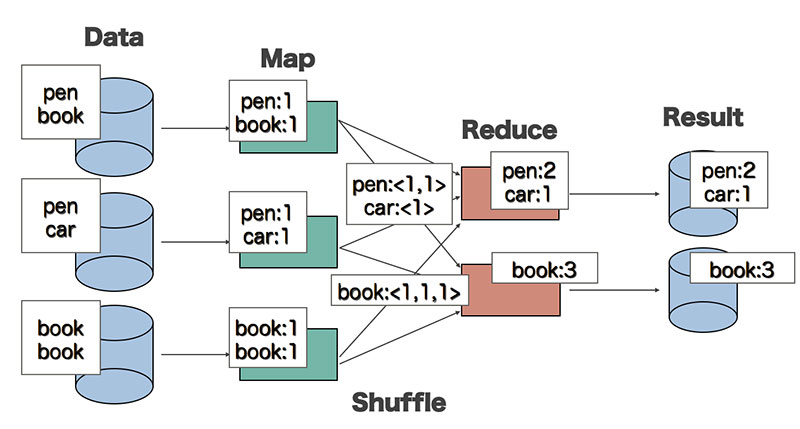

Đối với hàm Map:
  - Input là 1 đoạn văn bản
  - Output là các cặp <word, 1>
Hàm Map được thực hiện song song để xử lý các tập dữ liệu khác nhau.

Đối Với hàm Reduce:

  - Input có dạng <word, [list]>, trong đó list là tập hợp các giá trị đếm được của mỗi từ
  - Output: <word, tổng số lần xuất hiện của từ>
Hàm Reduce cũng được chạy song song để xử lý các tập từ khoá khác nhau.

Giữa hàm Map và Reduce có một giai đoạn xử lý trung gian gọi là hàm Shuffle. Hàm này có nhiệm vụ sắp xếp các từ và tổng hợp dữ liệu đầu vào cho Reduce từ các kết quả đầu ra của hàm Map.

Để hiện thực bài toán, bước đầu tiên cần phải import các thư viện cần thiết và khởi tạo project của spark như sau:


Bước tiếp theo trong project này, mình tiến hành đọc file input và đồng thời split các khoảng trắng bị thừa. Sau đó mình xử lý bớt các ký tự đặc biệt và chuyển các ký tự in hoa thành in thường. Ví dụ như có trường hợp chữ 'KIENTHIET' và 'kienthiet' có trong file text, sau khi xử lý qua hàm lower_clean_str bên dưới, cả hai ký tự trên đều sẽ được tính là 1 ký tự.


Đoạn code trên mình cũng thực hiện qua bước 'Map' như đã trình bày ở phần lý thuyết, chỉ cần gọi hàm map() có trong spark và truyền vào content của file text mình đã clean như trên.

Sau khi thực hiện bước map, mình thực hiện tiếp bước reduce. Ở đây mình sử dụng hàm reduce() để tính tổng các ký tự đã map. Hàm reduce này ngoài chức năng tính tổng ký tự còn có thể tìm max, min các ký tự trong map. Còn hàm reduceByKey() dùng để đếm tần số xuất hiện các từ có trong map.

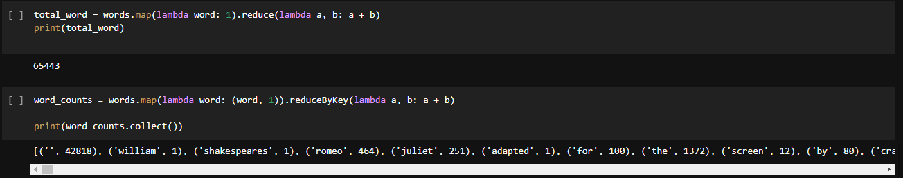

Kết quả dưới đây thể hiện tần suất xuất hiện của 20 ký tự đầu tiên có trong file input.txt:


<a name="chB"></a>

# B. Trình bày tổng quan về Spark Properties, Spark RDDs và Spark Dataframes

<a name="chB_I"></a>

## I. Spark Properties

<a name="chB_I_1"></a>

### 1. Tổng quan
  Spark cung cấp ba cấu trúc để cấu hình hệ thống:
  
   - Spark properties: Kiểm soát hầu hết các tham số ứng dụng và có thể được đặt bằng cách sử dụng đối tượng SparkConf hoặc thông qua các thuộc tính hệ thống Java.
   - Environment variables: Các biến môi trường có thể được sử dụng để đặt cài đặt cho mỗi máy, chẳng hạn như địa chỉ IP, thông qua tập lệnh conf / spark-env.sh trên mỗi nút.
   - Logging: Có thể được định cấu hình thông qua log4j.properties.

  Trong phần đầu tiên của bài viết này, ta sẽ tìm hiểu về cấu trúc cấu hình hệ thống của Spark, được gọi là Spark Properties.

  Spark properties có nhiệm vụ kiểm soát hầu hết các cài đặt ứng dụng và được cấu hình riêng cho từng ứng dụng sử dụng Spark. Các thuộc tính này có thể được đặt trực tiếp trên SparkConf và được chuyển tới SparkContext. SparkConf cho phép người dùng định nghĩa cấu hình một số thuộc tính phổ biến (ví dụ: URL chính và appname - tên ứng dụng), cũng như các cặp key-values tùy ý thông qua phương thức set (). Lấy ví dụ đối với chương trình wordCount, chúng ta có thể khởi tạo một ứng dụng với đơn luồng như sau:

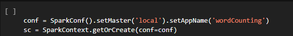

  Các properties chỉ định khoảng thời gian hay kích thước byte phải được cấu hình với một đơn vị thời gian hay đơn vị kích thước trong phạm vi cho phép sử dụng của Spark. Những định dạng về đơn vị kích thước và đơn vị thời gian sau được chấp nhận:

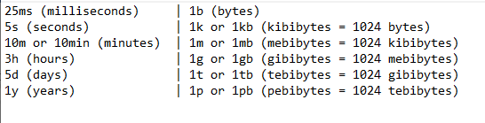
<a name="chB_I_2"></a>
### 2. Tải động đối với các thuộc tính của Spark
  Trong một số trường hợp, bạn có thể muốn tránh mã hóa cứng các cấu hình nhất định trong SparkConf. Ví dụ: Nếu bạn muốn chạy cùng một ứng dụng với các bản chính khác nhau hoặc số lượng bộ nhớ khác nhau. Spark cho phép bạn chỉ cần tạo một conf trống như sau:
  
  
  
  Khi đó bạn vẫn có thể cung cấp các giá trị cấu hình trong quá trình runtime bằng cách setting trực tiếp trên command line:
  
  
  
   Spark shell và spark-submit tool hỗ trợ hai cách để tải cấu hình động. Đầu tiên là các tùy chọn dòng lệnh, chẳng hạn như --master, như hình trên. spark-submit có thể chấp nhận bất kỳ thuộc tính Spark nào sử dụng cờ --conf / -c, nhưng sử dụng cờ đặc biệt cho các thuộc tính đóng một vai trò trong việc khởi chạy ứng dụng Spark. Chạy ./bin/spark-submit --help sẽ hiển thị toàn bộ danh sách các tùy chọn này.

  Trong khi đó, bin / spark-submit cũng sẽ đọc các tùy chọn cấu hình từ conf / spark-defaults.conf, trong đó mỗi dòng bao gồm một khóa và một giá trị được phân tách bằng khoảng trắng. Ví dụ:
  
  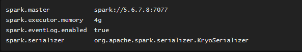
  
  Mọi giá trị được chỉ định dưới dạng flags hoặc properties file sẽ được chuyển đến ứng dụng và được hợp nhất với những giá trị được chỉ định thông qua SparkConf. Các thuộc tính được đặt trực tiếp trên SparkConf được ưu tiên cao nhất, sau đó các flags được chuyển đến spark-submit hoặc spark-shell, sau đó sẽ là các tùy chọn trong tệp spark-defaults.conf. Một vài khóa cấu hình đã được đổi tên kể từ các phiên bản Spark trước đó; tron trường hợp đó, các tên khóa cũ hơn vẫn được chấp nhận nhưng với sự ưu tiên thấp hơn bất kỳ trường hợp nào của khóa mới hơn.

  Các thuộc tính của Spark chủ yếu có thể được chia thành hai loại: một là liên quan đến triển khai, như “spark.driver.memory”, “spark.executor.instances”, loại thuộc tính này có thể không bị ảnh hưởng khi thiết lập lập trình thông qua SparkConf trong thời gian chạy, hoặc hành vi tùy thuộc vào trình quản lý cụm và chế độ triển khai bạn chọn, vì vậy bạn nên đặt thông qua tệp cấu hình hoặc tùy chọn dòng lệnh spark-submit. Một loại khác chủ yếu liên quan đến kiểm soát thời gian chạy Spark, như “spark.task.maxFailures”, loại thuộc tính này có thể được đặt theo một trong hai cách.
  
<a name="chB_I_3"></a>
### 3. Tổng hợp và phân loại các thuộc tính trong Spark
  
  Trang web http://driver:4040 liệt kê các thuộc tính Spark trong tab "Environment". Đây là một nơi hữu ích để kiểm tra và đảm bảo rằng các thuộc tính của bạn đã được sử dụng chính xác. Lưu ý rằng chỉ các giá trị được chỉ định rõ ràng thông qua spark-defaults.conf, SparkConf hoặc dòng lệnh mới xuất hiện. Đối với tất cả các thuộc tính cấu hình khác, bạn có thể cho rằng giá trị mặc định đang được sử dụng.
  
  Có rất nhiều Spark Properties, tùy vào mục đích sử dụng riêng biệt mà các các Spar properties khác nhau. Các bạn có thể truy cập đường link sau để có thể tra cứu đầy đủ và chi tiết nhất từng loại thuộc tính cũng như cách sử dụng và các giá trị mặc định : https://spark.apache.org/docs/latest/configuration.html#compression-and-serialization. Trong bài viết này chỉ để cập đến một số thuộc tính phổ biến và phân loại các thuộc tính đó dựa trên mục đích sử dụng như sau:
  
   - Application Properties: Hầu hết các thuộc tính kiểm soát cài đặt nội bộ đều có giá trị mặc định sẵn. Một số tùy chọn phổ biến nhất có thể kể đến là spark.app.namem spark.driver.cores, spark.driver.maxResultSize, spark.driver.memory.
   - Runtime Environment: Các thuộc tính này thường được sử dụng trong quá trình runtime để xử lý các biến môi trường. Một số properties phổ biến như spark.driver.extraClassPath, spark.driver.defaultJavaOptions, spark.driver.userClassPathFirst, spark.executor.extraLibraryPath, spark.python.profile.
   - Shuffle Behavior: Các properties này thường ít được sử dụng hơn, nó dùng để cung cấp các thuộc tính về mặt behavior cho chương trình như spark.reducer.maxSizeInFlight, spark.shuffle.compress, spark.shuffle.file.buffer, spark.shuffle.io.maxRetries, spark.shuffle.io.backLog
   - Spark UI: Cung cấp các thuộc tính về giao diện người dùng như spark.eventLog.logBlockUpdates.enabled, spark.eventLog.longForm.enabled, spark.eventLog.compress, spark.eventLog.dir, spark.eventLog.overwrite, spark.ui.enabled, spark.ui.port
   - Compression and Serialization: Các thuộc tính về nén và tuần tự hóa có thể kể đến spark.broadcast.compress, spark.checkpoint.compress, spark.io.compression.codec.
   - Memory Management: Đây là các thuộc tính dùng để quản lý bộ nhớ như spark.memory.fraction, spark.memory.storageFraction, spark.memory.offHeap, spark.cleaner
   - Execution Behavior: Loại thuộc tính này dùng để thực thi lớp hành vi của chương trình, có thể kể đến spark.broadcast.blockSize, spark.broadcast.checksum, spark.default.parallelism.
   - Executor Metrics: Các thuộc tính này để hiện thực các chỉ số, bao gồm 3 thuộc tính sau: spark.eventLog.logStageExecutorMetrics, spark.executor.processTreeMetrics.enabled và spark.executor.metrics.pollingInterval
   - Networking: Dùng trong các trường hợp liên quan đến mạng như spark.rpc.message.maxSize, spark.blockManager.port, spark.driver.bindAddress, spark.driver.host
   - Scheduling: Xử lý các tiến trình, bao gồm các spark.cores.max, spark.locality.wait, spark.scheduler.mode, spark.scheduler.revive.interval
   - Barrier Execution Mode: Gồm 3 thuộc tính day nhất: spark.barrier.sync.timeout, spark.scheduler.barrier.maxConcurrentTasksCheck.interval và spark.scheduler.barrier.maxConcurrentTasksCheck.maxFailures
   - Dynamic Allocation: spark.dynamicAllocation.enabled, spark.dynamicAllocation.executorIdleTimeout, spark.dynamicAllocation.executorAllocationRatio
   - Thread Configurations: Tùy thuộc vào công việc và cấu hình cụm, chúng ta có thể đặt số lượng luồng ở một số vị trí trong Spark để sử dụng hiệu quả các tài nguyên có sẵn nhằm đạt được hiệu suất tốt hơn. Trước Spark 3.0, các cấu hình luồng này áp dụng cho tất cả các vai trò của Spark, chẳng hạn như trình điều khiển, người thực thi, công nhân và chủ. Từ Spark 3.0, chúng ta có thể định cấu hình các luồng ở mức độ chi tiết tốt hơn bắt đầu từ trình điều khiển và trình thực thi. Lấy mô-đun RPC làm ví dụ trong bảng dưới đây. Đối với các mô-đun khác, chẳng hạn như xáo trộn, chỉ cần thay thế “rpc” bằng “xáo trộn” trong tên thuộc tính ngoại trừ spark. {Driver | executive} .rpc.netty.dispatcher.numThreads, chỉ dành cho mô-đun RPC.
   - Security
   - Spark SQL: Đối với properties này, ta có thể chia làm hai loại như sau:
     + Runtime SQL Configuration: là cấu hình Spark SQL cho mỗi phiên, có thể thay đổi. Chúng có thể được đặt với các giá trị ban đầu bằng tệp cấu hình và các tùy chọn dòng lệnh có tiền tố --conf / -c hoặc bằng cách đặt SparkConf được sử dụng để tạo SparkSession. Ngoài ra, chúng có thể được đặt và truy vấn bằng lệnh SET và đặt chúng về giá trị ban đầu bằng lệnh RESET hoặc bằng các phương thức setter và getter của SparkSession.conf trong thời gian chạy.
     + Static SQL Configuration: là các cấu hình Spark SQL xuyên phiên, bất biến. Chúng có thể được đặt với các giá trị cuối cùng bằng tệp cấu hình và các tùy chọn dòng lệnh có tiền tố --conf / -c hoặc bằng cách đặt SparkConf được sử dụng để tạo SparkSession. Người dùng bên ngoài có thể truy vấn các giá trị cấu hình sql tĩnh qua SparkSession.conf hoặc thông qua lệnh set, ví dụ: Đặt spark.sql.extensions ;, nhưng không thể đặt / bỏ thiết lập chúng.
   - Spark Streaming
   - SparkR
   - GraphX
   - Deploy
   - Cluster Managers: Mỗi trình quản lý cụm trong Spark có các tùy chọn cấu hình bổ sung:
     + YARN
     + Mesos
     + Kubernetes
     + Standalone Mode
<a name="chB_II"></a>

## II. Spark RDD

<a name="chB_II_1"></a>

### 1. Tổng quan

  Ở các cấp độ cao, mọi ứng dụng của Spark bao gồm một chương trình trình điều khiển chạy chức năng chính của người dùng và thực hiện các hoạt động song song khác nhau trên một cụm. Tính trừu tượng chính mà Spark cung cấp là tập dữ liệu phân tán có khả năng phục hồi (RDD), là tập hợp các phần tử được phân vùng trên các nút của cụm có thể hoạt động song song. RDD được tạo bằng cách bắt đầu bằng một tệp trong hệ thống tệp Hadoop (hoặc bất kỳ hệ thống tệp nào khác được Hadoop hỗ trợ) hoặc một bộ sưu tập Scala hiện có trong chương trình trình điều khiển và chuyển đổi nó. Người dùng cũng có thể yêu cầu Spark duy trì một RDD trong bộ nhớ, cho phép nó được sử dụng lại một cách hiệu quả trong các hoạt động song song. Cuối cùng, các RDD tự động phục hồi sau các lỗi của nút.
  
  Sự trừu tượng thứ hai trong Spark là các biến được chia sẻ có thể được sử dụng trong các hoạt động song song. Theo mặc định, khi Spark chạy song song một hàm dưới dạng một tập hợp các tác vụ trên các nút khác nhau, nó sẽ gửi một bản sao của từng biến được sử dụng trong hàm cho mỗi tác vụ. Đôi khi, một biến cần được chia sẻ giữa các tác vụ hoặc giữa các tác vụ và chương trình điều khiển. Spark hỗ trợ hai loại biến chia sẻ: biến quảng bá, có thể được sử dụng để lưu trữ một giá trị trong bộ nhớ trên tất cả các nút và bộ tích lũy, là những biến chỉ được “thêm” vào, chẳng hạn như bộ đếm và tổng.
  
  Resilient Distributed Datasets (RDD) là một cấu trúc dữ liệu cơ bản của Spark. Nó là một tập hợp bất biến phân tán của một đối tượng. Mỗi dataset trong RDD được chia ra thành nhiều phần vùng logical. Có thể được tính toán trên các node khác nhau của một cụm máy chủ (cluster).
  
  RDDs có thể chứa bất kỳ kiểu dữ liệu nào của Python, Java, hoặc đối tượng Scala, bao gồm các kiểu dữ liệu do người dùng định nghĩa. RDD chỉ cho phép đọc và phân mục tập hợp của các bản ghi. RDDs có thể được tạo ra qua điều khiển xác định trên dữ liệu trong bộ nhớ hoặc RDDs, RDD là một tập hợp có khả năng chịu lỗi mỗi thành phần có thể được tính toán song song.
 
 <a name="chB_II_2"></a>

### 2. Cài đặt Spark

  Spark 3.0.1 hoạt động với Python 2.7+ hoặc Python 3.4+. Nó có thể sử dụng trình thông dịch CPython tiêu chuẩn, vì vậy có thể sử dụng các thư viện C như NumPy. Nó cũng hoạt động với PyPy 2.3+.
  Các ứng dụng Spark trong Python có thể được chạy bằng tập lệnh bin / spark-submit bao gồm Spark khi chạy hoặc bằng cách đưa nó vào setup.py của bạn dưới dạng:

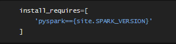

  Để chạy các ứng dụng Spark bằng Python mà không cần gõ câu lệnh pip cài đặt PySpark, hãy sử dụng tập lệnh bin/spark-submit nằm trong thư mục Spark. Tập lệnh này sẽ tải các thư viện Java/Scala của Spark và cho phép bạn gửi ứng dụng đến một cụm. Bạn cũng có thể sử dụng bin/pyspark để khởi chạy một trình bao Python tương tác.

  Nếu bạn muốn truy cập dữ liệu HDFS, bạn cần sử dụng một bản dựng của PySpark liên kết với phiên bản HDFS của bạn. Các gói dựng sẵn cũng có sẵn trên trang chủ Spark cho các phiên bản HDFS phổ biến. Cuối cùng, bạn cần nhập một số lớp Spark vào chương trình của mình bằng câu lệnh dưới đây:
 
  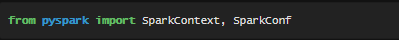
  
<a name="chB_II_3"></a>

### 3. Khởi tạo Spark
  Như đã trình bày ở chương I, điều đầu tiên mà chương trình Spark phải làm là tạo một đối tượng SparkContext, đối tượng này cho Spark biết cách truy cập một cụm. Để tạo SparkContext, trước tiên bạn cần xây dựng một đối tượng SparkConf chứa thông tin về ứng dụng của bạn:
  
   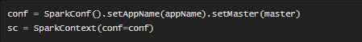
   
   Tham số appName là tên để ứng dụng của bạn hiển thị trên giao diện người dùng cụm. Chính là URL cụm Spark, Mesos hoặc YARN hoặc một chuỗi “cục bộ” đặc biệt để chạy ở chế độ cục bộ. Trên thực tế, khi chạy trên một cụm, bạn sẽ không muốn hardcode master trong chương trình mà phải khởi chạy ứng dụng bằng spark-submit và nhận nó ở đó. Tuy nhiên, đối với thử nghiệm cục bộ và thử nghiệm đơn vị, bạn có thể vượt qua “cục bộ” để chạy Spark trong quá trình.

<a name="chB_II_4"></a>

### 4.Resilient Distributed Datasets (RDDs)
  Như đã đề cập ở phần tổng quan, Spark hoạt động dựa trên khái niệm về tập dữ liệu phân tán có khả năng phục hồi (RDD). Đây là một tập hợp các phần tử có khả năng chịu lỗi và có thể hoạt động song song. Có hai cách để tạo RDD: song song một tập hợp hiện có trong chương trình trình điều khiển của bạn hoặc tham chiếu tập dữ liệu trong hệ thống lưu trữ bên ngoài, chẳng hạn như hệ thống tệp được chia sẻ, HDFS, HBase hoặc bất kỳ nguồn dữ liệu nào cung cấp Hadoop InputFormat.
  
 #### 4.1 Parallelized Collections
 
   Bộ sưu tập song song được tạo bằng cách gọi phương thức song song của SparkContext trên một bộ sưu tập hoặc bộ sưu tập có thể lặp lại hiện có trong chương trình trình điều khiển của bạn. Các phần tử của bộ sưu tập được sao chép để tạo thành một tập dữ liệu phân tán có thể hoạt động song song. Ví dụ: đây là cách tạo một tập hợp song song chứa các số từ 1 đến 5:
   


  Sau khi được tạo, tập dữ liệu phân tán (distData) có thể được vận hành song song. Ví dụ, chúng ta có thể gọi distData.reduce (lambda a, b: a + b) để thêm các phần tử của danh sách. Chúng tôi mô tả các hoạt động trên tập dữ liệu phân tán sau này.

  Một tham số quan trọng đối với các tập hợp song song là số lượng phân vùng để cắt tập dữ liệu vào. Spark sẽ chạy một tác vụ cho mỗi phân vùng của cụm. Thông thường, bạn muốn 2-4 phân vùng cho mỗi CPU trong cụm của mình. Thông thường, Spark cố gắng đặt số lượng phân vùng tự động dựa trên cụm của bạn. Tuy nhiên, bạn cũng có thể đặt nó theo cách thủ công bằng cách chuyển nó làm tham số thứ hai để song song hóa (ví dụ: sc.parallelize (data, 10)). Lưu ý: một số nơi trong mã sử dụng thuật ngữ lát (một từ đồng nghĩa với phân vùng) để duy trì khả năng tương thích ngược.

 #### 4.2 External Datasets
  PySpark có thể tạo tập dữ liệu phân tán từ bất kỳ nguồn lưu trữ nào được Hadoop hỗ trợ, bao gồm hệ thống tệp cục bộ của bạn, HDFS, Cassandra, HBase, Amazon S3, v.v. Spark hỗ trợ tệp văn bản, SequenceFiles và bất kỳ Hadoop InputFormat nào khác.

  Các RDD của tệp văn bản có thể được tạo bằng cách sử dụng phương thức textFile của SparkContext. Phương thức này lấy một URI cho tệp (đường dẫn cục bộ trên máy hoặc URI hdfs: //, s3a: //, v.v.) và đọc nó như một tập hợp các dòng. Đây là một lời gọi ví dụ:
     


  Sau khi được tạo, distFile có thể được thực hiện bằng các hoạt động của tập dữ liệu. Ví dụ, chúng ta có thể cộng kích thước của tất cả các dòng bằng cách sử dụng bản đồ và các phép toán giảm như sau: distFile.map (lambda s: len (s)). Reduce (lambda a, b: a + b).

  Một số lưu ý khi đọc tệp với Spark:

   - Nếu sử dụng một đường dẫn trên hệ thống tệp cục bộ, tệp cũng phải có thể truy cập được tại cùng một đường dẫn trên các nút công nhân. Sao chép tệp cho tất cả công nhân hoặc sử dụng hệ thống tệp chia sẻ được gắn kết trên mạng.
   - Tất cả các phương thức nhập dựa trên tệp của Spark, bao gồm cả textFile, đều hỗ trợ chạy trên thư mục, tệp nén và cả ký tự đại diện. Ví dụ: bạn có thể sử dụng textFile ('/ my / directory'), textFile ('/ my / directory / *. Txt') và textFile ('/ my / directory / *. Gz').
   - Phương thức textFile cũng có đối số thứ hai tùy chọn để kiểm soát số lượng phân vùng của tệp. Theo mặc định, Spark tạo một phân vùng cho mỗi khối của tệp (các khối là 128MB theo mặc định trong HDFS), nhưng bạn cũng có thể yêu cầu số lượng phân vùng cao hơn bằng cách chuyển một giá trị lớn hơn. Lưu ý rằng bạn không thể có ít phân vùng hơn khối.
   Ngoài các tệp văn bản, API Python của Spark cũng hỗ trợ một số định dạng dữ liệu khác:
   
   - SparkContext.wholeTextFiles cho phép bạn đọc một thư mục chứa nhiều tệp văn bản nhỏ và trả về từng tệp dưới dạng cặp (tên tệp, nội dung). Điều này trái ngược với textFile, nó sẽ trả về một bản ghi trên mỗi dòng trong mỗi tệp.
   - RDD.saveAsPickleFile và SparkContext.pickleFile hỗ trợ lưu RDD ở định dạng đơn giản bao gồm các đối tượng Python được chọn lọc. Lô hàng được sử dụng trong tuần tự hóa dưa chua, với kích thước lô mặc định là 10.
   - Định dạng đầu vào / đầu ra của SequenceFile và Hadoop.
   
  PySpark SequenceFile hỗ trọ tải RDD của các cặp khóa-giá trị bên trong Java, chuyển đổi Writables thành các kiểu Java cơ sở và chọn các đối tượng Java kết quả bằng cách sử dụng Pyrolite. Khi lưu RDD của các cặp khóa-giá trị vào SequenceFile, PySpark thực hiện ngược lại. Nó giải nén các đối tượng Python thành các đối tượng Java và sau đó chuyển đổi chúng thành Writables. Các Writables sau được tự động chuyển đổi.
  
  Mảng không được xử lý theo kiểu out-of-the-box. Người dùng cần chỉ định các kiểu phụ ArrayW ghi tùy chỉnh khi đọc hoặc ghi. Khi viết, người dùng cũng cần chỉ định bộ chuyển đổi tùy chỉnh chuyển đổi mảng thành kiểu con ArrayW ghi tùy chỉnh. Khi đọc, trình chuyển đổi mặc định sẽ chuyển đổi các kiểu phụ ArrayW ghi tùy chỉnh thành Đối tượng Java [], sau đó được chuyển thành các bộ giá trị Python. Để lấy array.array trong Python cho các mảng kiểu nguyên thủy, người dùng cần chỉ định bộ chuyển đổi tùy chỉnh.

  Tương tự như các tệp văn bản, SequenceFiles có thể được lưu và tải bằng cách chỉ định đường dẫn. Các lớp khóa và giá trị có thể được chỉ định, nhưng đối với Writables tiêu chuẩn thì điều này không bắt buộc.


#### 4.3 RDD Operations
  RDD hỗ trợ hai loại hoạt động: biến đổi, tạo ra một tập dữ liệu mới từ một tập dữ liệu hiện có và các hành động, trả về một giá trị cho chương trình trình điều khiển sau khi chạy một tính toán trên tập dữ liệu. Ví dụ, bản đồ là một phép biến đổi chuyển từng phần tử tập dữ liệu qua một hàm và trả về một RDD mới đại diện cho kết quả. Mặt khác, Reduce là một hành động tổng hợp tất cả các phần tử của RDD bằng cách sử dụng một số chức năng và trả về kết quả cuối cùng cho chương trình điều khiển (mặc dù cũng có một hàm ReduceByKey song song trả về một tập dữ liệu phân tán).
  
  Tất cả các phép biến đổi trong Spark đều lười biếng, ở chỗ chúng không tính toán ngay kết quả của chúng. Thay vào đó, họ chỉ nhớ các phép biến đổi được áp dụng cho một số tập dữ liệu cơ sở (ví dụ: một tệp). Các phép biến đổi chỉ được tính khi một hành động yêu cầu kết quả được trả về chương trình điều khiển. Thiết kế này giúp Spark chạy hiệu quả hơn. Ví dụ, chúng ta có thể nhận ra rằng một tập dữ liệu được tạo thông qua bản đồ sẽ được sử dụng để giảm và chỉ trả về kết quả của việc giảm tới trình điều khiển, thay vì tập dữ liệu được ánh xạ lớn hơn.

  Theo mặc định, mỗi RDD đã chuyển đổi có thể được tính toán lại mỗi khi bạn chạy một hành động trên đó. Tuy nhiên, bạn cũng có thể duy trì một RDD trong bộ nhớ bằng cách sử dụng phương thức dai dẳng (hoặc bộ nhớ cache), trong trường hợp đó Spark sẽ giữ các phần tử xung quanh trên cụm để truy cập nhanh hơn nhiều vào lần tiếp theo bạn truy vấn nó. Ngoài ra còn có hỗ trợ cho các RDD lâu dài trên đĩa hoặc được sao chép qua nhiều nút.

  Để minh họa những điều cơ bản về RDD, hãy xem xét chương trình đơn giản dưới đây:
  
  
  
  Dòng đầu tiên xác định một RDD cơ sở từ một tệp bên ngoài. Tập dữ liệu này không được tải trong bộ nhớ hoặc không được hoạt động trên: các dòng chỉ là một con trỏ đến tệp. Dòng thứ hai xác định lineLengths là kết quả của việc chuyển đổi bản đồ. Một lần nữa, lineLengths không được tính toán ngay lập tức, do sự lười biếng. Cuối cùng, chúng tôi chạy giảm, đó là một hành động. Tại thời điểm này, Spark chia nhỏ tính toán thành các tác vụ để chạy trên các máy riêng biệt và mỗi máy chạy cả phần bản đồ và phần giảm cục bộ, chỉ trả lại câu trả lời cho chương trình điều khiển.
Trong khi hầu hết các hoạt động của Spark hoạt động trên RDD có chứa bất kỳ loại đối tượng nào, một vài hoạt động đặc biệt chỉ khả dụng trên RDD của các cặp khóa-giá trị. Các thao tác phổ biến nhất là các thao tác “xáo trộn” được phân phối, chẳng hạn như nhóm hoặc tổng hợp các phần tử bằng một khóa.

  Trong Python, các hoạt động này hoạt động trên RDD có chứa các bộ giá trị Python được tích hợp sẵn như (1, 2). Đơn giản chỉ cần tạo các bộ giá trị như vậy và sau đó gọi hoạt động mong muốn của bạn.

  Ví dụ: đoạn mã sau sử dụng thao tác ReduceByKey trên các cặp khóa-giá trị để đếm số lần mỗi dòng văn bản xuất hiện trong một tệp:
  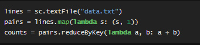
  
  Chúng ta cũng có thể sử dụng counts.sortByKey () để sắp xếp các cặp theo thứ tự bảng chữ cái, và cuối cùng counts.collect () để đưa chúng trở lại chương trình điều khiển dưới dạng danh sách các đối tượng.
  
#### 4.4 RDD Persistence 
  
  Một trong những khả năng quan trọng nhất trong Spark là duy trì (hoặc lưu vào bộ nhớ đệm) một tập dữ liệu trong bộ nhớ qua các hoạt động. Khi bạn duy trì một RDD, mỗi nút lưu trữ bất kỳ phân vùng nào của nó mà nó tính toán trong bộ nhớ và sử dụng lại chúng trong các hành động khác trên tập dữ liệu đó (hoặc các tập dữ liệu bắt nguồn từ nó). Điều này cho phép các hành động trong tương lai nhanh hơn nhiều (thường gấp hơn 10 lần). Bộ nhớ đệm là một công cụ chính cho các thuật toán lặp đi lặp lại và sử dụng tương tác nhanh.

  Bạn có thể đánh dấu một RDD sẽ được duy trì bằng cách sử dụng các phương thức Kiên trì () hoặc cache () trên đó. Lần đầu tiên nó được tính toán trong một hành động, nó sẽ được lưu trong bộ nhớ trên các nút. Bộ nhớ cache của Spark có khả năng chịu lỗi - nếu bất kỳ phân vùng nào của RDD bị mất, nó sẽ tự động được tính toán lại bằng cách sử dụng các phép biến đổi đã tạo ra ban đầu.

  Ngoài ra, mỗi RDD tồn tại có thể được lưu trữ bằng cách sử dụng một mức lưu trữ khác nhau, chẳng hạn như cho phép bạn duy trì tập dữ liệu trên đĩa, duy trì nó trong bộ nhớ nhưng dưới dạng các đối tượng Java được tuần tự hóa (để tiết kiệm dung lượng), sao chép nó qua các nút. Các cấp độ này được thiết lập bằng cách chuyển một đối tượng StorageLevel (Scala, Java, Python) sang Persext (). Phương thức cache () là một cách viết tắt để sử dụng mức lưu trữ mặc định, đó là StorageLevel.MEMORY_ONLY (lưu trữ các đối tượng được giải phóng trong bộ nhớ). Tập hợp đầy đủ các mức lưu trữ bạn có thể tham khảo theo đường link: https://spark.apache.org/docs/latest/rdd-programming-guide.html#rdd-persistence.

  Lưu ý rằng trong Python, các đối tượng được lưu trữ sẽ luôn được tuần tự hóa với thư viện Pickle, vì vậy việc bạn chọn mức độ tuần tự hóa không quan trọng. Các cấp bộ nhớ khả dụng trong Python bao gồm MEMORY_ONLY, MEMORY_ONLY_2, MEMORY_AND_DISK, MEMORY_AND_DISK_2, DISK_ONLY và DISK_ONLY_2.

  Spark cũng tự động lưu giữ một số dữ liệu trung gian trong các hoạt động xáo trộn (ví dụ: ReduceByKey), ngay cả khi người dùng không gọi vẫn tiếp tục. Điều này được thực hiện để tránh tính toán lại toàn bộ dữ liệu đầu vào nếu một nút bị lỗi trong quá trình trộn. Chúng tôi vẫn khuyến nghị người dùng tiếp tục gọi RDD kết quả nếu họ định sử dụng lại nó.

<a name="chB_III"></a>

## III. Spark Dataframes

<a name="chB_III_1"></a>

### 1. Tổng quan
  Trong Spark, DataFrames là tập hợp dữ liệu phân tán, được tổ chức thành các hàng và cột. Mỗi cột trong DataFrame có tên và kiểu liên kết. DataFrames tương tự như các bảng cơ sở dữ liệu truyền thống, được cấu trúc và ngắn gọn. Có thể nói rằng DataFrames là cơ sở dữ liệu quan hệ với các kỹ thuật tối ưu hóa tốt hơn.
  Spark DataFrames có thể được tạo từ nhiều nguồn khác nhau, chẳng hạn như bảng Hive, bảng nhật ký, cơ sở dữ liệu bên ngoài hoặc RDD hiện có. DataFrames cho phép xử lý một lượng lớn dữ liệu.
 <a name="chB_III_2"></a>
### 2. Sử dụng DataFrames bổ sung cho RDD trong Spark
  Khi Apache Spark 1.3 ra mắt, nó đi kèm với một API mới có tên là DataFrames giúp giải quyết các hạn chế về hiệu suất và khả năng mở rộng xảy ra trong khi sử dụng RDD.

  Khi không có nhiều không gian lưu trữ trong bộ nhớ hoặc trên đĩa, các RDD sẽ không hoạt động bình thường khi chúng cạn kiệt. Bên cạnh đó, Spark RDD không có khái niệm về lược đồ—cấu trúc của một cơ sở dữ liệu xác định các đối tượng của nó. RDD lưu trữ cả dữ liệu có cấu trúc và không có cấu trúc cùng nhau, điều này không hiệu quả lắm.

  RDD không thể sửa đổi hệ thống theo cách để nó chạy hiệu quả hơn. Các RDD không cho phép chúng tôi gỡ lỗi trong thời gian chạy. Chúng lưu trữ dữ liệu dưới dạng một tập hợp các đối tượng Java.

  Các RDD sử dụng kỹ thuật tuần tự hóa (chuyển đổi một đối tượng thành một dòng byte để cho phép xử lý nhanh hơn) và thu gom rác (một kỹ thuật quản lý bộ nhớ tự động phát hiện các đối tượng không sử dụng và giải phóng chúng khỏi bộ nhớ). Điều này làm tăng chi phí trên bộ nhớ của hệ thống vì chúng rất dài.

  Đây là khi Spark DataFrames được giới thiệu để khắc phục những hạn chế mà Spark RDD có. Bây giờ, điều gì làm cho Spark DataFrames trở nên độc đáo? Hãy cùng xem các tính năng của Spark DataFrames khiến chúng trở nên phổ biến.
  <a name="chB_III_3"></a>
### 3. Tính năng chính của DataFrames
  Một số tính năng độc đáo của DataFrames là:
    - Sử dụng các công cụ tối ưu hóa input: DataFrames sử dụng các công cụ tối ưu hóa đầu vào, ví dụ: Trình tối ưu hóa xúc tác, để xử lý dữ liệu hiệu quả. Chúng ta có thể sử dụng cùng một công cụ cho tất cả các API Python, Java, Scala và R DataFrame.
    - Xử lý dữ liệu có cấu trúc: DataFrames cung cấp một cái nhìn sơ đồ về dữ liệu. Ở đây, dữ liệu có một số ý nghĩa đối với nó khi nó đang được lưu trữ.
    - Quản lý bộ nhớ tùy chỉnh: Trong RDD, dữ liệu được lưu trữ trong bộ nhớ, trong khi DataFrames lưu trữ dữ liệu ngoài đống (bên ngoài không gian chính của Java Heap, nhưng vẫn bên trong RAM), do đó làm giảm quá tải bộ sưu tập rác.
    - Tính linh hoạt: DataFrames, giống như RDD, có thể hỗ trợ nhiều định dạng dữ liệu khác nhau, chẳng hạn như CSV, Cassandra, v.v.
    - Khả năng mở rộng: DataFrames có thể được tích hợp với nhiều công cụ Big Data khác và chúng cho phép xử lý megabyte đến petabyte dữ liệu cùng một lúc.
<a name="chB_III_4"></a>
### 4. Khởi tạo DataFrames
  Có nhiều cách để tạo DataFrames, trong đó có 3 phương pháp dưới đây là phổ biến nhất:
#### 4.1 Khởi tạo DataFrames từ tập tin JSON
  JSON là viết tắt của JavaScript Object Notation, là một loại tệp lưu trữ các đối tượng cấu trúc dữ liệu đơn giản ở định dạng .json. Nó chủ yếu được sử dụng để truyền dữ liệu giữa các máy chủ Web.
  Khi nói đến Spark, các tệp .json đang được tải không phải là tệp .json điển hình. Chúng ta không thể tải tệp JSON bình thường vào DataFrame. Tệp JSON mà chúng ta tải phải ở định dạng được cung cấp bên dưới:
  


  Các tệp JSON có thể được tải lên DataFrames bằng cách sử dụng hàm read.JSON, với tên tệp mà chúng tôi muốn tải lên. Ví dụ, chúng ta đang tải bảng đếm huy chương Olympic lên DataFrame. Tổng cộng có 10 trường. Hàm printSchema () in ra lược đồ của DataFrame như dưới đây:
  
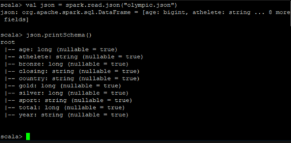

#### 4.2 Khởi tạo DataFrames từ RDDs đã tạo sẵn
  DataFrames cũng có thể được tạo từ các RDD hiện có. Đầu tiên, chúng ta tạo một RDD và sau đó tải RDD đó vào một DataFrame bằng cách sử dụng hàm createDataFrame (Name_of_the_rdd_file).
  Trong hình dưới đây, trước tiên chúng ta đang tạo một RDD, chứa các số từ 1 đến 10 và các hình khối của chúng. Sau đó, chúng tôi sẽ tải RDD đó vào DataFrame.
  


#### 4.3 Khởi tạo DataFrames từ tập tin CSV
  Chúng ta cũng có thể tạo DataFrames bằng cách tải các tệp .csv. Đây là một ví dụ về tải tệp .csv lên DataFrame:
  
  

<a name="chB_III_5"></a>
### 5. Làm việc với DataFrames

#### 5.1 Union hai DataFrames
  Để nối hai DataFrames với nhau, ta sử dụng câu lệnh sau:
  ```
  unionDF = df1.union(df2)
	display(unionDF)
  ```
#### 5.2 Ghi DataFrame hợp nhất vào tệp Parquet

  ```
  # Remove the file if it exists
  dbutils.fs.rm("/tmp/databricks-df-example.parquet", True)
  unionDF.write.parquet("/tmp/databricks-df-example.parquet")
  ```
#### 5.3 Đọc DataFrame từ tệp Parquet

  ```
  parquetDF = spark.read.parquet("/tmp/databricks-df-example.parquet")
  display(parquetDF)
   ```

#### 5.4 Explode cột trong DataFrames
  Ta lấy ví dụ cần giải phóng cột employees như sau:
  ```
  from pyspark.sql.functions import explode

  explodeDF = unionDF.select(explode("employees").alias("e"))
  flattenDF = explodeDF.selectExpr("e.firstName", "e.lastName", "e.email", "e.salary")
    
  flattenDF.show()
   ```
   Kết quả là:
  
  |firstName|lastName|               email|salary|
  |---------|--------|--------------------|------|
  |  michael|armbrust|no-reply@berkeley...|100000|
  | xiangrui|    meng|no-reply@stanford...|120000|
  |    matei|    null|no-reply@waterloo...|140000|
  |     null| wendell|no-reply@berkeley...|160000|
  |  michael| jackson| no-reply@neverla.nd| 80000|
  |     null| wendell|no-reply@berkeley...|160000|
  | xiangrui|    meng|no-reply@stanford...|120000|
  |    matei|    null|no-reply@waterloo...|140000|

#### 5.5 Sử dụng filter () để trả về các hàng khớp với một đơn vị từ
  ```
  filterDF = flattenDF.filter(flattenDF.firstName == "xiangrui").sort(flattenDF.lastName)
  display(filterDF)
  ```
  ```
  from pyspark.sql.functions import col, asc

  # Use `|` instead of `or`
  filterDF = flattenDF.filter((col("firstName") == "xiangrui") | (col("firstName") == "michael")).sort(asc("lastName"))
  display(filterDF)
  ```
  Thay vì sử dụng “or”, ta có thể dùng dấu “|” trong hàm fillter().

#### 5.6 Sử dụng hàm where()
  Hàm where() tương tự như hàm filter(), cụ thể như sau:
  ```
  whereDF = flattenDF.where((col("firstName") == "xiangrui") | (col("firstName") == "michael")).sort(asc("lastName"))
  display(whereDF)
  ```
#### 5.7 Thay thế các giá trị trong DataFrames null bằng fillna()
  ```
  nonNullDF = flattenDF.fillna("--")
  display(nonNullDF)
  ```

#### 5.8 Chỉ truy xuất các hàm bị thiếu giá trị
  Trong ví dụ này, ta truy xuất các giá trị bị thiếu firstname và lastname:
  ```
  filterNonNullDF = flattenDF.filter(col("firstName").isNull() | col("lastName").isNull()).sort("email")
  display(filterNonNullDF)
  ```

  Còn rất nhiều hàm hữu ích trong Dataframes, tùy vào mục đích sử dụng mà ta gọi các hàm tương ứng. Để có thể tìm hiểu hơn về danh sách các hàm của Dataframes, các bạn có thể truy cập link sau: [DataFrames](https://spark.apache.org/docs/1.6.1/api/java/org/apache/spark/sql/DataFrame.html)
<a name="chC"></a>

# C. Thuật toán A_priori trên môi trường PySpark và bài toán Association Rule

<a name="chC_I"></a>

## I. Tổng quan 

 Thuật toán Apriori được công bố bởi R. Agrawal và R. Srikant vào năm 1994 vì để tìm các tập phổ biến trong một bộ dữ liệu lớn. Tên của thuật toán là Apriori vì nó sử dụng kiến thức đã có từ trước (prior) về các thuộc tính, vật phẩm thường xuyên xuất hiện trong cơ sở dữ liệu. Để cải thiện hiệu quả của việc lọc các mục thường xuyên theo cấp độ, một thuộc tính quan trọng được sử dụng gọi là thuộc tính Apriori giúp giảm phạm vi tìm kiếm của thuật toán.
 Để minh họa cho các khái niệm, ta lấy ví dụ CSDL với các giao dịch sau. | TID (mã giao dịch) | Itemset (tập các hạng mục) | 1 | A, B, E 2 | B, D 3 | B, C 4 | A, B, D 5 | A, C 6 | B, C 7 | A, C 8 | A, B, C, E 9 | A, B, C

- Hạng mục (item): mặt hàng A = apple, B = bread, C = cereal, D = donuts, E = eggs.
- Tập các hạng mục (itemset): danh sách các hạng mục trong giỏ hàng như {A, B, C, D, E}.
- Giao dịch (transaction): tập các hạng mục được mua trong một giỏ hàng, lưu kèm với mã giao dịch (TID).
- Mẫu phổ biến (frequent item): là mẫu xuất hiện thường xuyên trong tập dữ liệu như {A, C} xuất hiện khá nhiều trong các giao dịch.
- Tập k-hạng mục (k-itemset): ví dụ danh sách sản phẩm (1-itemset) như {A, B, C}, danh sách cặp sản phẩm đi kèm (2-itemset) như {{A, B}, {A, C}}, danh sách 3 sản phẩm đi kèm (3-itemset) như {{A, B, C}, {B, C, E}}.
- Độ phổ biến (support): được tính bằng supp(X) = \frac{count(X)}{|D|}. X = {B, C} là tập các hạng mục, D là cơ sở dữ liệu (CSDL) giao dịch.
- Tập phổ biến (frequent itemset): là tập các hạng mục S (itemset) thỏa mãn độ phổ biến tối thiểu (minsupp – do người dùng xác định như 40% hoặc xuất hiện 5 lần). Nếu supp(S) \geq minsupp thì S là tập phổ biến.
- Tập phổ biến tối đại (max pattern) thỏa supp(X) \geq minsupp không tồn tại |X’| > |X|, với X’ cũng phổ biến
- Tập phổ biến đóng (closed pattern) thỏa supp(S) \geq minsupp không tồn tại |X’| > |X| mà supp(X’) = supp(X)
- Luật kết hợp (association rule): kí hiệu X \rightarrow Y, nghĩa là khi X có mặt thì Y cũng có mặt (với xác suất nào đó). Ví dụ, A \rightarrow B; A,B \rightarrow C; B,D \rightarrow E.
- Độ tin cậy (confidence): được tính bằng conf(X) = \frac{supp(X+Y)}{supp(X)}.
<a name="chC_II"></a>
## II. Bài toán Association Rules với cơ sở dữ liệu store_data
Trong repo này của mình có code minh họa bài toán tìm Association Rule sử dụng thuật toán A-priori trên môi trường PySpark với cơ sở dữ liệu [store_data.csv](https://drive.google.com/file/d/1y5DYn0dGoSbC22xowBq2d4po6h1JxcTQ/view?usp=sharing). Đây là link file [Jupyter Notebook](https://github.com/smoothkt4951/Massive-Data-Processing-Course/blob/main/A-priori/A_priori.ipynb) và link [Google Colab](https://colab.research.google.com/drive/1WTDOtKL3DR66tBmM_AtKvi_vtJWtCb--?usp=sharing) của mình, trong đó có giải thích rất rõ từng bước thực hiện và kết quả cùng với công dụng của từng hàm nên mình tránh trình bày dài dòng ở đây, mời bạn đọc ghé qua để xem mình code những gì trong đó nha.
<a name="chD"></a>
# D. Thuật toán Locality Sensitive Hashing trong bài toán Finding Similar Documents in Massive Data
 Mình may mắn được tiếp cận với một đề tài khá hay trong khóa học về Massive Data Processing, cụ thể trong đề tài này mình sẽ nghiên cứu về thuật toán Locality Sensitive Hashing (LSH) trong bài toán tìm kiếm các văn bản tương tự trong tập văn bản. Dưới đây là minh họa cho đề tài:   
 
 
 
 Dưới đây là phần mình tìm hiểu về thuật toán LSH và ứng dụng vào bài toán tìm các văn bản tương tự trong tập văn bản,phần này chiếm 3 điểm trong đề tài nên mình viết khá ngắn gọn để tiện trình bày trước lớp nhưng cũng rất đầy đủ và chi tiết, mời các bạn đọc qua.
 <a name="chD_I"></a>
 ## I. Tổng quan
 <a name="chD_I_1"></a>
### 1. Bài toán tìm kiếm các văn bản tương tự trong tập văn bản
 Một trong những vấn đề cơ bản trong khai thác dữ liệu là khám phá dữ liệu để tìm các mục tương tự với nhau. Việc tìm kiếm các tài liệu, văn bản, hình ảnh, âm thanh (gọi chung là documents) tương tự nhau là một vấn đề dựa trên các tập hợp dữ liệu lớn và được thực hiện dựa trên phương pháp Shingling. Sau đó, các tập hợp dữ liệu lớn này có thể được nén lại dựa trên sự giống nhau của các tập hợp chính và có thể được phân biệt với các phiên bản nén của chúng, điều này sẽ được thực hiện thông qua phương pháp Min Hashing. Nếu chúng ta  muốn tránh so sánh tất cả các tài liệu với nhau và chỉ so sánh các tài liệu có xác suất cao sẽ trùng lắp thì chúng ta nên sử dụng phương pháp Locality-Sensitive Hashing (LSH). 
 Trong bài báo cáo này, chúng em sẽ trình bày phương pháp sử Locality Sensitive Hashing để tìm kiếm các văn bản tương tự trong tập văn bản. Phương pháp này sẽ lần lượt thực hiện qua ba bước. Bước đầu tiên là Shingling, đây là bước chuyển đổi tập dữ liệu văn bản và thiết lập đại diện mỗi văn bản một ID, sau đó đến bước Min Hashing chuyển đổi tập hợp dữ liệu lớn thành signatures trong khi vẫn giữ được tính chất đặc trưng ban đầu của tập dữ liệu này. Bước cuối cùng là sử dụng phương pháp Locality-Sensitive Hashing để tập trung so sánh các cặp signatures có thể trùng lắp nhau và cho ra kết quả với xác xuất cao nhất có thể.
  <a name="chD_I_2"></a>
 ### 2. Jaccard Similarity
  Để tiếp cận bài toán này, ta cần tập trung vào khái niệm về sự giống nhau giữa các văn bản trong tập dữ liệu văn bản. Các văn bản sẽ được biểu diễn bởi một mục trong tập dữ liệu văn bản lớn, sự giống nhau giữa các văn bản sẽ phụ thuộc vào giao điểm giữa các mục đó với nhau. Dựa vào đó, ta tìm kiếm các mục gần nhất với một mục mà ta đang xét. Để phân tích loại tương tự này, chúng em sẽ phân tích và khảo sát dựa trên Jaccard Similarity.
  Jaccard Similarity của hai tập hợp tương đương với tỷ lệ giá trị của giao điểm của các tập hợp với giá trị của liên hợp của chúng. Cụ thể, Jaccard của hai bộ T và S sẽ được hiển thị dưới dạng SIM (S, T) và được tính toán thông qua phương trình dưới đây:
		`SIM(S,T) = (|S ᴖ T|)/(|S ᴗ T|)`

 Khía cạnh tương tự giữa các văn bản mà chúng ta đang đề cập ở đây là sự tương đồng về mức độ của các ký tự trong một văn bản chứ không phải là sự giống nhau về ý nghĩa của các văn bản. Đó là lý do tại sao chúng ta nên xét tất cả các ký tự hiện có trong tài liệu. Tìm kiếm điểm tương đồng trong các văn bản có các ứng dụng khác nhau, một số ứng dụng bao gồm tìm kiếm các văn bản lặp lại, các văn bản tương tự nhau và phát hiện đạo văn.
<a name="chD_II"></a>
## II. Phương pháp Shingling 
 Giải pháp hiệu quả nhất để hiển thị tài liệu văn bản dưới dạng tập dữ liệu là chọn các chuỗi từ tài liệu và đặt chúng thành một tập hợp (set). Nếu chúng ta làm như vậy, các tài liệu được chia thành các phần nhỏ của câu hoặc thậm chí các cụm từ sẽ có một số yếu tố chung có thể xuất hiện theo trình tự khác nhau trong hai tài liệu. Sử dụng tính chất của Jaccard Similarity của các tập hợp này, người ta có thể tính toán lượng tương tự của chúng. Như chúng ta đã biết, trong một tài liệu sẽ bao gồm rất nhiều chuỗi, mỗi chuỗi bao gồm các ký tự. Đối với một documents, khái niệm “k-shingle” sẽ là bất kỳ chuỗi con nào có độ dài k đã xuất hiện trong tài liệu. Trong phương pháp này, ta sẽ chọn một bộ k-shingles từ mọi tài liệu đã được lặp lại một lần hoặc nhiều lần bên trong nó và phân bổ nó vào tài liệu.
 Ví dụ, giả sử rằng tài liệu D chứa chuỗi “abcdabd” và giá trị của k tương đương với 2. Khi đó tập hợp 2 shingles cho tài liệu D sẽ là {ab, bc, cd, da, bd}. Lưu ý ở đây là chuỗi con “ab” đã xuất hiện trong tài liệu D tới hai lần, nhưng chỉ được coi là một chuỗi ký tự. 
 Ta có thể chọn bất kỳ giá trị hằng số nào cho k. Nếu giá trị mà chúng ta chọn cho k quá nhỏ, thì một số chuỗi được chọn với độ dài k sẽ tồn tại trong phần lớn tài liệu. Trong trường hợp này, chúng ta sẽ có một tập hợp các shingles có mức độ Shingle Similarity cao. Ví dụ: nếu chúng ta lấy giá trị của k là 1 thì phần lớn các trang web sẽ có nhiều ký tự chung và một số ít ký tự không phổ biến. Trong trường hợp này, tất cả các trang web sẽ có độ tương đồng cao. 
 Thực tế là k của chúng ta lớn đến mức độ nào phụ thuộc vào độ dài của tài liệu và độ lớn của tập hợp các ký tự. Tuy nhiên ở bất kỳ giá trị k nào thì luôn có một điểm quan trọng mà chúng ta cần lưu ý là k nên được chọn đủ lớn để khả năng mọi shingle đều có thể xuất hiện trong tài liệu.
<a name="chD_III"></a>
## III. Phương pháp Minhashing
 Các tập dữ liệu chứa shingles thường có khối lượng rất lớn, nếu chúng ta có hàng triệu tài liệu, có thể việc thiết lập tất cả các shingles trong bộ nhớ chính là điều khó có thể thực hiện và tốn nhiều chi phi bộ nhớ. Mục tiêu chính của phương pháp Minhash này là thay thế các tập dữ liệu lớn bằng các biểu diễn nhỏ được gọi là “signatures”, tức chữ ký theo nghĩa đen. Mục đích ta sử dụng các signatures này là thông qua nó ta có thể so sánh các signatures của hai tập shingles và ước tính Jaccard Similarity của các shingles.
 Để tạo signatures, trước tiên chúng ta cần hiển thị các tập hợp shingles bằng cách sử dụng ma trận. Ma trận này có thể hiển thị tất cả các tập hợp được gọi là ma trận đặc trưng (characteristic matrix). Các cột của ma trận này tương ứng với các tập hợp shingles (ký hiệu là S_i) và các hàng của nó tương ứng với các mục của tập hợp phổ quát (ký hiệu là S) nằm trong số các thành phần của tất cả các tập hợp. Trong hàng r và cột c của ma trận này, giá trị “1” sẽ được đặt nếu phần tử của hàng r thuộc tập dữ liệu của cột c, ngược lại sẽ là giá trị “0”.
Ví dụ minh họa bên dưới cho thấy một ma trận đặc trưng cho các tập S1 = {a, d}, S2 = {c}, S3 = {b, d, e} và S4 = {a, c, d} và tập hợp phổ quát S = {a, b, c, d, e}


		Element	S1	S2	S3	S4
		a	1	0	0	1
		b	0	0	1	0
		c	0	1	0	1
		d	1	0	1	1
		e	0	0	1	0

 Các signatures mà chúng em muốn tạo cho các tập hợp bao gồm các kết quả của một số phép tính và mỗi phép tính này là một minhash của ma trận đặc trưng. Tính toán giá trị của minhash cho một tập hợp được hiển thị trong một cột của ma trận đặc trưng bằng cách chọn một hoán vị của các hàng. Trong trường hợp này, giá trị của minhash trong mỗi cột bằng số của hàng đầu tiên (trong chuỗi hoán vị), trong đó cột có giá trị sẽ là “1.” 
 Ví dụ với ma trận đặc trưng ở trên, giả sử rằng chuỗi các hoán vị là “beadc”. Hoán vị này định nghĩa một hàm minhash (ký hiệu là h) ghi các tập hợp trên các hàng. Có nghĩa là hàm minhash sẽ thay thế các dòng của ma trận đặc trưng đó. Cụ thể sau khi hoán vị đã được áp dụng cho các hàng ma trận đặc trưng trở thành ma trận dưới đây:

		
		Element	S1	S2	S3	S4
		b	0	0	1	0
		e	0	0	1	0
		a	1	0	0	1
		d	1	0	1	1
		c	0	1	0	1

 Sau khi đã hoán vị ma trận đặc trưng, để tính toán minhash của tập hợp S1, chúng em sẽ xét các cột liên quan đến nó và coi hàng đầu tiên có giá trị “1” là giá trị minhash. Do đó h(S1) = a, tương tự ta có h(S2) = c, h(S3) = b và h(S4) = a. 
 Một tính chất quan trọng của phương pháp minhashing là có một mối liên quan giữa phương pháp này với Jaccard Similarity của các tập hợp đã bị minhash. Trong mối quan hệ này, khả năng một minhash cho hai tập hợp trong một hoán vị ngẫu nhiên của các hàng có thể tạo ra các giá trị giống hệt nhau bằng giá trị của Jaccard Similarity trong hai tập hợp này. Có nghĩa là đối với hai bộ S1 và S2, khả năng h (S1) = h (S2) bằng SIM (S1, S2) .
 Sau khi xét phương pháp tính minhash, ta cần tạo một ma trận đặc trưng bằng cách sử dụng một số hàm minhash. Đầu tiên chúng ta chọn n hoán vị ngẫu nhiên của các hàng của ma trận đặc trưng. Các hàm minhash được xác định bằng cách sử dụng các hoán vị h1, h2, ... hn. Với mỗi cột của ma trận đặc trưng cho tập S, chúng ta tính vectơ [h1 (S), h2 (S), ..., hn (S)] và vectơ này là signatures của minhash của cột S. Do đó, chúng ta có thể thay thế signatures minhash của cột “i” bằng cột “i” trong ma trận đặc trưng và biến nó thành ma trận đặc trưng. 
 Điều đặc biệt ở đây là số cột trong ma trận signatures chỉ bằng “n”. Do đó, kích thước của ma trận signatures nhỏ hơn rất nhiều so với kích thước của ma trận đặc trưng. Hơn nữa, với mối quan hệ mà phương pháp minhash so với Jaccard Similarity đã đề cập ở trên, tính tương tự của các tài liệu sẽ được giữ nguyên ở một mức độ nào đó và sẽ không biến mất sau các phép biến đổi này. 
 Trên thực tế, không thể áp dụng hoán vị cho một ma trận đặc trưng lớn. Ngay cả việc chọn một hoán vị ngẫu nhiên từ một số lượng lớn các hàng và sắp xếp các dòng vào thứ tự dựa trên hoán vị cũng đã khá tốn thời gian. Giải pháp tối ưu nhất là ta áp dụng hoán vị cho ma trận bằng cách sử dụng các hàm băm. Thay vì chọn n hoán vị ngẫu nhiên từ các hàng, chúng ta chọn ngẫu nhiên n hàm băm của h1, h2,…, hn từ các hàng. Chúng ta coi SIG (i, c) là một phần tử của ma trận chữ ký cho hàm băm i và cột c. Đầu tiên, chúng ta đặt SIG (i, c) bằng vô cực cho tất cả các chữ “i” và “c”. Để tính toán ma trận signatures, ta duyệt lần lượt từng hàng của ma trận đặc trưng. Có thể minh họa thuật toán này bằng 5 bước trong mã giã dưới đây:
 

 
  Từ thuật toán trên ta có thể tính toán ma trận minhash của ma trận đặc trưng trong Bảng 1. Đầu tiên, chúng ta cần chọn n hàm minhash. Đối với ví dụ trong Bảng 1, ta đặt n bằng 2 và chọn hai hàm băm là h1 (x) = x + 1 mod 5 và h2 (x) = 3x + 1 mod 5. Sau đó đánh số thứ tự các hàng từ 0 đến 4. Bảng 3 dưới đây là ma trận đặc trưng cùng với các giá trị được tính cho các hàm băm cho mỗi hàng:
  
			Row	Element	S1	S2	S3	S4	x+1 mod 5	3x+1 mod 5
			0	a	1	0	0	1	1	1
			1	b	0	0	1	0	2	4
			2	c	0	1	0	1	3	2
			3	d	1	0	1	1	4	0
			4	e	0	0	1	0	0	3
 Bây giờ, để tính ma trận signatures có 4 hàng 2 cột, trước tiên chúng ta đặt tất cả các mục của nó bằng ∞ và sau đó thực hiện thuật toán trên ma trận đặc trưng đã cho các giá trị tính được trước đó. Sau khi thực hiện thuật toán và xét tất cả các dòng của ma trận đặc trưng, ma trận minhash signatures sẽ có kết quả như sau:


			Functions	S1	S2	S3	S4
			h1	1	3	0	1
			h2	0	2	0	0
 Theo như đã trình bày ở trên, sự giống nhau của các tập có thể được ước lượng bằng cách nhìn vào ma trận minhash signatures này. Tuy nhiên sự ước lượng này sẽ chính xác khi ma trận minhash signatures quá lớn, ngược lại ước tính sẽ không đủ chính xác cho các ma trận minhash signatures có kích thước rất nhỏ.
<a name="chD_IV"></a>
## IV. Phương pháp Locality Sensitive Hashing
<a name="chD_IV_1"></a>
### 4.1 Phương pháp LSH trong tập tài liệu văn bản
 Khi chúng ta tìm kiếm các thành tương tự, chúng ta không chỉ đơn giản là cố gắng tính toán độ giống nhau của một cặp tài liệu mà là chúng ta so sánh tất cả các tài liệu với nhau sau đó xác định các tài liệu nào tương tự tài liệu nào. Việc xét toàn bộ các cặp tài liệu tốn khá nhiều thời gian. Để giải quyết vấn đề này, chúng ta chỉ nên tập trung xét các cặp có khả nănng giống nhau nhất và hạn chế việc điều tra từng cặp tài liệu với nhau. Giải pháp chung cho tác vụ này là phương pháp LSH (Locality Sensitive Hashing).
 Lý thuyết chung cho phương pháp LSH là chúng ta băm các thành phần nhiều lần sao cho các thành gần giống nhau sẽ băm vào một mảng chung. Sau đó, trong mỗi phép băm, mỗi cặp được kết nối với một nhóm sẽ được coi như một cặp ứng cử viên. Để tìm các tài liệu văn bản tương tự nhau trong tập dữ liệu văn bản, ta chỉ cần xét các cặp ứng cử viên. Trong bài toán phát hiện văn bản giống nhau mà ta đang giải quyết, tất cả các tài liệu văn bản trong tập dữ liệu sẽ không được xét, những tài liệu nào không liên quan sẽ được bỏ qua, từ đó hạn chế được nhiều chi phí cũng như tối ưu hóa được phương pháp giải bài toán.
<a name="chD_IV_2"></a>
### 4.2 Phương pháp LSH cho Minhash Signatures
 Nếu ta có một minhash signatures của các items trong tập dữ liệu, ta có thể áp dụng phương pháp LSH bằng cách chia ma trận signatures thành b dải sao cho mỗi dải bao gồm r hàng (n = br). Sau đó đối với mỗi dải ta sẽ chọn một hàm băm và hàm vectơ này sẽ cung cấp nhiều nhóm sử dụng r số nguyên cùng với một số lượng lớn các hàm băm cho chúng. Chúng ta có thể sử dụng cùng một hàm băm cho tất cả các dải, nhưng chúng ta sử dụng một mảng riêng để băm trong mỗi dải để các cột có vectơ tương tự không được kết nối với cùng một nhóm trong các dải khác nhau. Ví dụ bên dưới cho thấy các thành phần của ma trận signatures bao gồm 12 dòng được chia thành 4 dải và mỗi dải có 3 hàng:

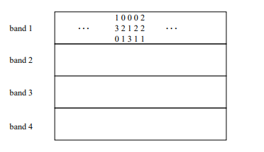
 
 Trong hình trên, cột thứ hai và thứ tư trong dải đầu tiên hiển thị vectơ [0, 2, 1] và chúng được kết nối với cùng một nhóm trong phép băm của dải đầu tiên. Do đó, bất kể thực tế là các cột này có giống nhau ở ba dải khác hay không, cặp cột này có thể được coi là một cặp ứng cử viên. Hơn nữa, hai cột không phù hợp trong dải đầu tiên có cơ hội trở thành một cặp ứng cử viên trong ba dải khác. Trên thực tế, có thể chúng giống nhau ở mỗi nhóm khác. Ở bất kỳ mức độ nào, hai cột cực kỳ giống nhau sẽ giống nhau nhất ở một số dải. Do đó, phương pháp này trực tiếp “match” các cột tương tự lại với nhau với xác suất cao hơn so với các cặp khác nhau.
<a name="chD_IV_3"></a>
### 4.3 Phân tích phương pháp LSH
 Giả sử ta sử dụng b dải, mỗi dải chứa r hàng và giả sử một cặp tài liệu văn bản nào đó có Jaccard Similarity với giá trị là s. Ta biết rằng khả năng các minhash signatures cho các tài liệu văn bản này trong mỗi dòng nhất định của ma trận signatures phù hợp với nhau bằng s. Khả năng các tài liệu này (hoặc tốt nhất là signatures của chúng) là một cặp ứng cử viên có thể được tính toán như sau:

 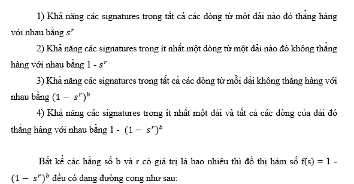

 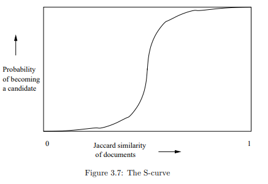

 Ta có một khái niện mới là “giới hạn ngưỡng” (threshold limit), là số lượng cặp văn bản tương tự trong s khi quá trình tăng dần của biểu đồ đạt đến giới hạn cao nhất. Số lượng giới hạn ngưỡng giúp ta xác định chất lượng của sự phát hiện tương đồng. Chất lượng của sự tương đồng này phụ thuộc vào hai giá trị false positive và false negative. Giới hạn ngưỡng này là một hàm số của b và r và giá trị được tính bằng xấp xỉ t = 〖(1/b)〗^(1/r) . Ví dụ: nếu b = 16 và r = 4, thì ngưỡng xấp xỉ tại s = 1/2 , vì căn mũ 4 của 1/16 là 1/2.

 Trong phương pháp LSH, có hai khả năng xảy ra là false positive và false negative. Các kết quả false positive là các cặp khác nhau được băm vào cùng một nhóm và false negative là các cặp tương tự không được gửi đến cùng một nhóm. Có nghĩa là các kết quả false positive là các cặp bị nhầm lẫn là một cặp ứng cử viên và các kết quả false negative là các cặp bị nhầm lẫn không được coi là một cặp ứng viên. 
Như đã trình bày ở trên, khả năng hai cặp có Jaccard Similarity của s có thể trở thành một cặp ứng cử viên bằng 1 -  〖(1- s^r)〗^b.  Bản chất bên trong của đồ thị hàm số f(s) = 1 -  〖(1- s^r)〗^b này cho ta biết nếu tính từ 0 đến giới hạn ngưỡng (t) sẽ được kết quả bằng số lượng false positive vì các cặp có Jaccard Similarity nhỏ hơn t sẽ không được coi là cặp ứng viên. Trong hình dưới đây biểu diễn đồ thị của hàm f(s) cùng với các khu vực liên quan đến số lượng false positive và false negative.

## V. Crawling data từ các đầu báo Việt Nam
 Đây là phần chiếm 2 điểm cộng trong đề tài này, yêu cầu là xây dựng một hệ thống để crawling dữ liệu từ các trang tin tức, lọc bỏ bản tin trùng để xây dựng một trang tin tức tổng hợp.
 Do vấn đề crawling data từ các trang tin tức ở Việt Nam sẽ rất cần thiết cho các bạn học sinh, sinh viên đang nghiên cứu về lĩnh vực Big Data, ngoài ra cấu trúc website của các trang báo thay đổi liên tục đòi hỏi việc update source code mới có crawl dữ liệu nên mình tạo một repo [crawling-VietNam-News](https://github.com/smoothkt4951/crawling-VietNam-News) riêng chứa source và mô tả, mời các bạn ghé thăm, nếu thấy hữu ích hãy cho mình một star để ửng hộ mình nha <3.
<a name="refer"></a>
# Tham khảo
## Chương A:
1. [online] Available at: https://viblo.asia/p/tong-quan-ve-apache-spark-cho-he-thong-big-data-RQqKLxR6K7z
2. [online] Available at: https://viblo.asia/p/tim-hieu-ve-hadoop-bJzKmOBXl9N
3. [online] Available at: https://sparkbyexamples.com/apache-spark-rdd/spark-reducebykey-usage-with-examples/

## Chương B:
1. [online] Available at:  https://spark.apache.org/docs/latest/sql-programming-guide.html. [Accessed 29 January 2021]
2. [online] Available at: https://intellipaat.com/blog/tutorial/spark-tutorial/spark-dataframe/. [Accessed 29 January 2021]
3. [online] Available at:  https://spark.apache.org/docs/1.6.1/api/java/org/apache/spark/sql/DataFrame.html. [Accessed 29 January 2021]
4. [online] Available at: https://docs.databricks.com/spark/latest/dataframes-datasets/introduction-to-dataframes-python.html. [Accessed 29 January 2021]
5. [online] Available at: https://spark.apache.org/docs/latest/rdd-programming-guide.html#rdd-persistence. [Accessed 29 January 2021]
6. [online] Available at:  https://spark.apache.org/docs/latest/configuration.html#viewing-spark-properties

## Chương C:
1. [online] Available at:  https://ongxuanhong.wordpress.com/2015/08/23/khai-thac-luat-tap-pho-bien-frequent-itemsets-voi-thuat-toan-apriori/ [Accessed 21 February 2021]

## Chương D:
1. https://github.com/smoothkt4951/Massive-Data-Processing-Course/tree/main/LSH-for-Finding-Similar-Items/documents/03-lsh.pdf
2. https://github.com/smoothkt4951/Massive-Data-Processing-Course/blob/main/LSH-for-Finding-Similar-Items/documents/04-lsh_theory.pdf
3. https://github.com/smoothkt4951/Massive-Data-Processing-Course/blob/main/LSH-for-Finding-Similar-Items/documents/ch3_2.pdf
